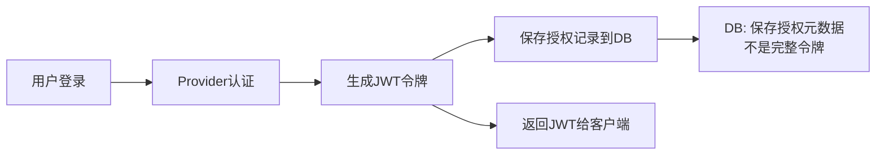
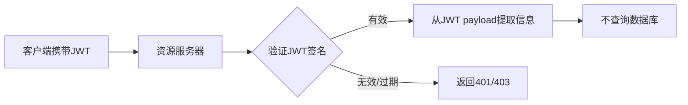

**不完全正确。** 令牌的"存储"和"获取"涉及不同层次，让我详细解释：

## 1. **什么被存储到了数据库？**

在代码的**第9步**：

```
this.authorizationService.save(authorization);
```

保存到数据库的**不是原始令牌字符串**，而是**授权记录对象** `OAuth2Authorization`，包含：

```
OAuth2Authorization 授权记录包含：
├── 授权ID (唯一标识)
├── 注册客户端信息
├── 用户主体信息
├── 授权类型 (PASSWORD)
├── 授权范围 (scopes)
├── 令牌元数据 (Tokens 元信息) ← 这是关键！
│   ├── AccessToken 元数据 (不一定是完整令牌)
│   ├── RefreshToken 元数据
│   └── IDToken 元数据
└── 其他属性
```

## 2. **令牌的两种形式**

### **情况A：不透明令牌 (Opaque Token)**

```
// 如果使用数据库存储的令牌
// 令牌本身只是一个随机字符串
String token = "eyJhbGciOiJIUzI1NiIsInR5cCI6IkpXVCJ9..."

// 验证时需要查询数据库：
1. 客户端发送令牌 → 资源服务器
2. 资源服务器查询数据库/缓存验证
3. 返回用户信息和权限
```

### **情况B：JWT 令牌 (自包含令牌)**

```
// 如果是JWT令牌
// 令牌本身包含了用户信息，不需要查询数据库验证
String jwt = "header.payload.signature"
// payload 包含：{"sub":"user123","exp":1672531200,"scopes":["read","write"]}
```

## 3. **你的代码中的令牌处理**

从代码看，你的系统**可能使用的是JWT**：

```
// 代码中的线索：
OAuth2Token generatedAccessToken = this.tokenGenerator.generate(tokenContext);
// tokenGenerator 可能是 JwtGenerator

// 如果是JWT令牌验证：
1. 客户端发送JWT → 资源服务器
2. 资源服务器用公钥验证签名（不查数据库）
3. 从JWT payload直接读取用户信息
```

## 4. **实际流程分析**

### **令牌生成时**：




### **令牌验证时**：




## 5. **数据库存储的作用**

即使使用JWT，**数据库中的授权记录仍然很重要**，用于：

1. **令牌吊销**：用户注销/管理员撤销令牌
2. **会话管理**：查看用户的活跃会话
3. **审计日志**：记录登录历史
4. **刷新令牌验证**：刷新令牌通常需要查库验证
5. **令牌黑名单**：可以标记被吊销的令牌

## 6. **如何确认你的系统类型？**

检查配置：

```
# 配置1：JWT方式（不查库验证）
spring:
  security:
    oauth2:
      resourceserver:
        jwt:
          issuer-uri: http://localhost:9000

# 配置2：不透明令牌（需要查库）
spring:
  security:
    oauth2:
      resourceserver:
        opaque-token:
          introspection-uri: http://localhost:9000/oauth2/introspect
          client-id: client
          client-secret: secret
```

## 7. **总结**

| 方面         | 数据库存储的授权记录 | JWT令牌本身            |
| ------------ | -------------------- | ---------------------- |
| **存储位置** | 数据库表中           | 客户端本地/HTTP Header |
| **验证方式** | 需要查询数据库       | 验证签名（不查库）     |
| **包含信息** | 授权元数据           | 用户信息+声明          |
| **查询频率** | 低（管理操作）       | 每次API调用都验证签名  |

**结论**：

- 你的代码将**授权记录**保存到数据库
- 但**令牌验证可能不查数据库**（如果是JWT）
- 数据库主要用于**令牌管理**而非**每次验证**

要100%确定，需要查看：

1. `OAuth2TokenGenerator`的具体实现
2. Spring Security 资源服务器的配置
3. 令牌的实际格式（是否包含3个点分隔的部分）