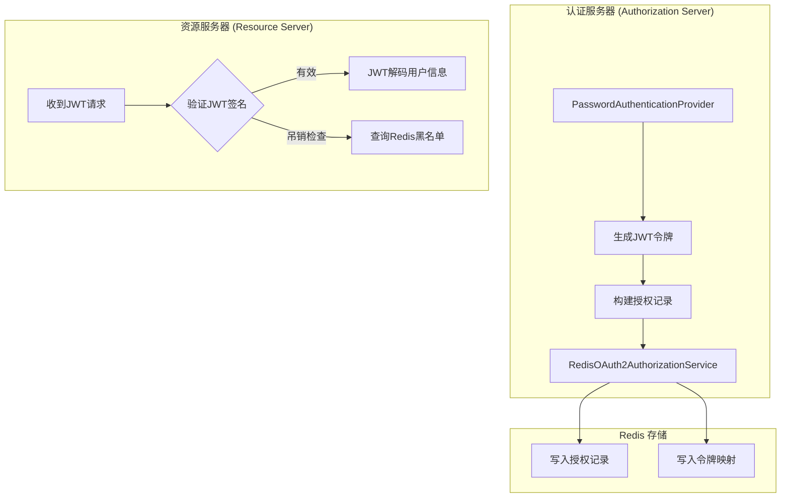
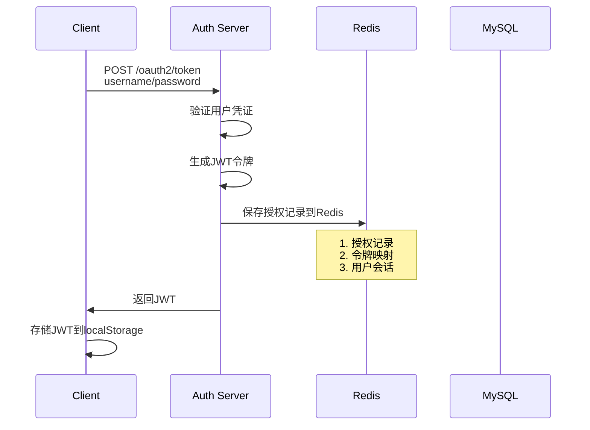
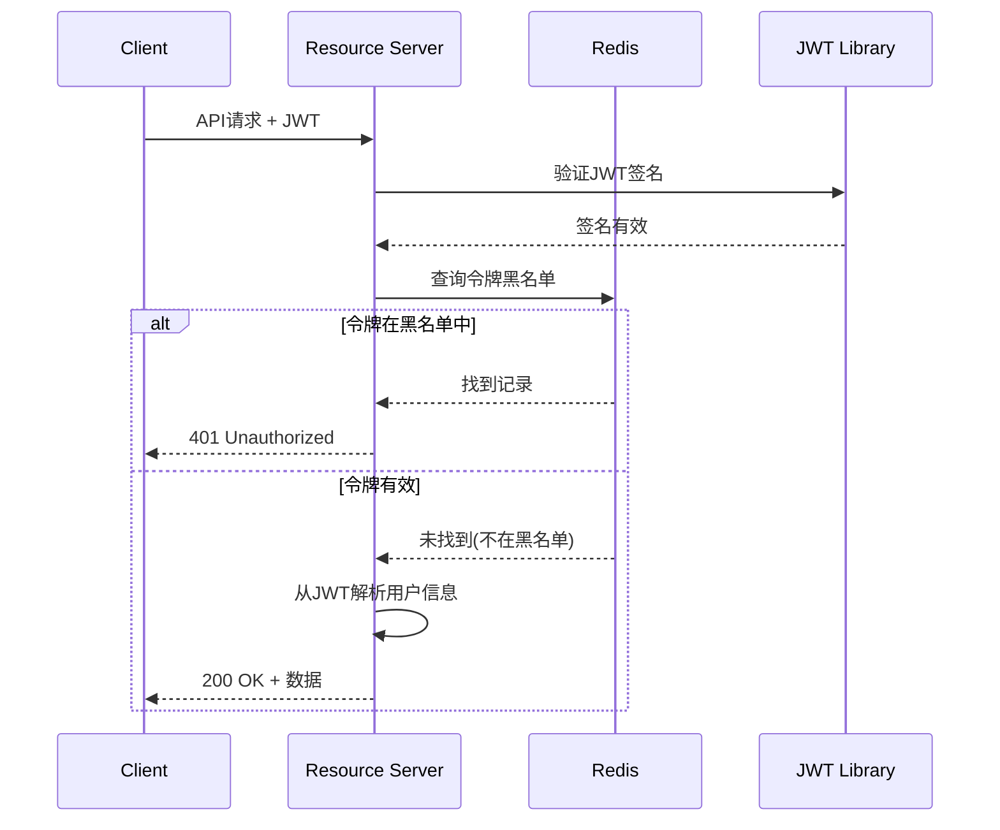

# **令牌存储到 Redis 的完整流程**

## 1. **核心架构概览**



## 2. **Redis 存储的具体实现**

### **2.1 自定义 RedisOAuth2AuthorizationService**

```
@Component
@Slf4j
public class RedisOAuth2AuthorizationService implements OAuth2AuthorizationService {
    
    private final RedisTemplate<String, Object> redisTemplate;
    
    // Redis Key 前缀
    private static final String AUTHORIZATION_KEY_PREFIX = "oauth2:authorization:";
    private static final String ACCESS_TOKEN_KEY_PREFIX = "oauth2:access_token:";
    private static final String REFRESH_TOKEN_KEY_PREFIX = "oauth2:refresh_token:";
    private static final String USER_SESSIONS_KEY_PREFIX = "oauth2:user_sessions:";
    
    // TTL 配置
    @Value("${oauth2.token.access-token-ttl:7200}")
    private Long accessTokenTtl;  // 2小时
    
    @Value("${oauth2.token.refresh-token-ttl:2592000}")
    private Long refreshTokenTtl;  // 30天
    
    /**
     * 保存授权记录到 Redis
     */
    @Override
    public void save(OAuth2Authorization authorization) {
        if (authorization == null) {
            throw new IllegalArgumentException("authorization cannot be null");
        }
        
        String authId = authorization.getId();
        String clientId = authorization.getRegisteredClientId();
        String username = authorization.getPrincipalName();
        
        // 1. 保存完整的授权记录
        String authKey = AUTHORIZATION_KEY_PREFIX + authId;
        redisTemplate.opsForValue().set(
            authKey, 
            authorization, 
            refreshTokenTtl,  // 使用刷新令牌的TTL
            TimeUnit.SECONDS
        );
        
        // 2. 建立令牌到授权ID的映射
        OAuth2Authorization.Token<OAuth2AccessToken> accessToken = 
            authorization.getToken(OAuth2AccessToken.class);
        OAuth2Authorization.Token<OAuth2RefreshToken> refreshToken = 
            authorization.getToken(OAuth2RefreshToken.class);
        
        if (accessToken != null && accessToken.getToken() != null) {
            String accessTokenKey = ACCESS_TOKEN_KEY_PREFIX + 
                hashToken(accessToken.getToken().getTokenValue());
            redisTemplate.opsForValue().set(
                accessTokenKey, 
                authId, 
                accessTokenTtl, 
                TimeUnit.SECONDS
            );
        }
        
        if (refreshToken != null && refreshToken.getToken() != null) {
            String refreshTokenKey = REFRESH_TOKEN_KEY_PREFIX + 
                hashToken(refreshToken.getToken().getTokenValue());
            redisTemplate.opsForValue().set(
                refreshTokenKey, 
                authId, 
                refreshTokenTtl, 
                TimeUnit.SECONDS
            );
        }
        
        // 3. 记录用户会话（用于会话管理）
        String userSessionsKey = USER_SESSIONS_KEY_PREFIX + username + ":" + clientId;
        redisTemplate.opsForSet().add(userSessionsKey, authId);
        redisTemplate.expire(userSessionsKey, refreshTokenTtl, TimeUnit.SECONDS);
        
        log.debug("授权记录保存到Redis: authId={}, clientId={}, username={}", 
            authId, clientId, username);
    }
    
    /**
     * 从 Redis 删除授权记录
     */
    @Override
    public void remove(OAuth2Authorization authorization) {
        if (authorization == null) {
            return;
        }
        
        String authId = authorization.getId();
        String username = authorization.getPrincipalName();
        String clientId = authorization.getRegisteredClientId();
        
        // 1. 删除令牌映射
        OAuth2Authorization.Token<OAuth2AccessToken> accessToken = 
            authorization.getToken(OAuth2AccessToken.class);
        OAuth2Authorization.Token<OAuth2RefreshToken> refreshToken = 
            authorization.getToken(OAuth2RefreshToken.class);
        
        if (accessToken != null && accessToken.getToken() != null) {
            String accessTokenKey = ACCESS_TOKEN_KEY_PREFIX + 
                hashToken(accessToken.getToken().getTokenValue());
            redisTemplate.delete(accessTokenKey);
        }
        
        if (refreshToken != null && refreshToken.getToken() != null) {
            String refreshTokenKey = REFRESH_TOKEN_KEY_PREFIX + 
                hashToken(refreshToken.getToken().getTokenValue());
            redisTemplate.delete(refreshTokenKey);
        }
        
        // 2. 从用户会话中移除
        String userSessionsKey = USER_SESSIONS_KEY_PREFIX + username + ":" + clientId;
        redisTemplate.opsForSet().remove(userSessionsKey, authId);
        
        // 3. 删除授权记录本身
        String authKey = AUTHORIZATION_KEY_PREFIX + authId;
        redisTemplate.delete(authKey);
        
        log.debug("从Redis删除授权记录: authId={}", authId);
    }
    
    /**
     * 通过授权ID查找
     */
    @Override
    public OAuth2Authorization findById(String id) {
        String key = AUTHORIZATION_KEY_PREFIX + id;
        return (OAuth2Authorization) redisTemplate.opsForValue().get(key);
    }
    
    /**
     * 通过令牌查找授权记录
     */
    @Override
    public OAuth2Authorization findByToken(String token, OAuth2TokenType tokenType) {
        if (token == null) {
            return null;
        }
        
        String tokenKey = null;
        if (OAuth2TokenType.ACCESS_TOKEN.equals(tokenType)) {
            tokenKey = ACCESS_TOKEN_KEY_PREFIX + hashToken(token);
        } else if (OAuth2TokenType.REFRESH_TOKEN.equals(tokenType)) {
            tokenKey = REFRESH_TOKEN_KEY_PREFIX + hashToken(token);
        } else {
            return null;
        }
        
        // 1. 通过令牌找到授权ID
        String authId = (String) redisTemplate.opsForValue().get(tokenKey);
        if (authId == null) {
            return null;
        }
        
        // 2. 通过授权ID找到完整授权记录
        return findById(authId);
    }
    
    /**
     * 令牌哈希（保护敏感信息）
     */
    private String hashToken(String token) {
        try {
            MessageDigest digest = MessageDigest.getInstance("SHA-256");
            byte[] hash = digest.digest(token.getBytes(StandardCharsets.UTF_8));
            return Hex.encodeHexString(hash);
        } catch (NoSuchAlgorithmException e) {
            throw new RuntimeException(e);
        }
    }
}
```

### **2.2 Redis 数据结构设计**

```
Redis 数据结构:

# 1. 授权记录主表
KEY: oauth2:authorization:{authId}
VALUE: OAuth2Authorization 对象 (序列化)
TTL: 30天 (刷新令牌有效期)

# 2. 访问令牌映射
KEY: oauth2:access_token:{sha256(token)}
VALUE: authId
TTL: 2小时 (访问令牌有效期)

# 3. 刷新令牌映射
KEY: oauth2:refresh_token:{sha256(token)}
VALUE: authId
TTL: 30天

# 4. 用户会话集合
KEY: oauth2:user_sessions:{username}:{clientId}
VALUE: Set<authId> 用户的所有活跃会话
TTL: 30天
```

## 3. **与你的 Provider 集成**

### **3.1 配置注入**

```
@Configuration
@EnableWebSecurity
public class SecurityConfig {
    
    @Bean
    @Primary
    public OAuth2AuthorizationService redisOAuth2AuthorizationService(
            RedisConnectionFactory connectionFactory,
            ObjectMapper objectMapper) {
        
        // 创建 RedisTemplate
        RedisTemplate<String, Object> redisTemplate = new RedisTemplate<>();
        redisTemplate.setConnectionFactory(connectionFactory);
        
        // 配置序列化
        GenericJackson2JsonRedisSerializer serializer = 
            new GenericJackson2JsonRedisSerializer(objectMapper);
        redisTemplate.setKeySerializer(new StringRedisSerializer());
        redisTemplate.setValueSerializer(serializer);
        redisTemplate.afterPropertiesSet();
        
        return new RedisOAuth2AuthorizationService(redisTemplate);
    }
    
    @Bean
    public PasswordAuthenticationProvider passwordAuthenticationProvider(
            AuthenticationManager authenticationManager,
            OAuth2TokenGenerator<?> tokenGenerator) {
        
        // 注入 Redis 实现的授权服务
        return new PasswordAuthenticationProvider(
            authenticationManager,
            redisOAuth2AuthorizationService(),  // ← 这里注入Redis实现
            tokenGenerator
        );
    }
}
```

## 4. **JWT + Redis 的完整流程**

### **4.1 登录流程（写Redis）**




### **4.2 令牌验证流程（读Redis）**




## 5. **Redis 存储的优势**

| 优势           | 说明                             |
| -------------- | -------------------------------- |
| **高性能**     | 读取速度快（微秒级），适合高并发 |
| **自动过期**   | 利用 Redis TTL 自动清理过期令牌  |
| **分布式支持** | 多实例共享会话状态               |
| **实时吊销**   | 可以快速将令牌加入黑名单         |
| **会话管理**   | 轻松查询用户的所有活跃会话       |

## 6. **生产环境最佳实践**

### **6.1 Redis 配置**

```
spring:
  redis:
    host: ${REDIS_HOST:localhost}
    port: ${REDIS_PORT:6379}
    password: ${REDIS_PASSWORD:}
    database: ${REDIS_DB:0}
    timeout: 2000ms
    lettuce:
      pool:
        max-active: 8
        max-idle: 8
        min-idle: 0
        max-wait: -1ms

oauth2:
  token:
    access-token-ttl: 7200      # 2小时
    refresh-token-ttl: 2592000  # 30天
    jwt-blacklist-ttl: 86400    # 黑名单保留1天
```

### **6.2 集群和高可用**

```
@Configuration
public class RedisClusterConfig {
    
    @Bean
    public RedisConnectionFactory redisConnectionFactory() {
        RedisClusterConfiguration clusterConfig = new RedisClusterConfiguration();
        clusterConfig.addClusterNode(new RedisNode("redis1", 6379));
        clusterConfig.addClusterNode(new RedisNode("redis2", 6379));
        clusterConfig.addClusterNode(new RedisNode("redis3", 6379));
        
        return new LettuceConnectionFactory(clusterConfig);
    }
}
```

## 7. **注意事项**

1. **Redis 数据持久化**：建议开启 AOF 或 RDB 持久化
2. **内存管理**：监控 Redis 内存使用，设置合理的 maxmemory
3. **网络分区**：考虑 Redis Sentinel 或 Cluster 实现高可用
4. **序列化**：确保 `OAuth2Authorization`对象正确序列化
5. **令牌哈希**：存储令牌哈希值而非原始令牌，提高安全性

## 8. **扩展功能**

### **令牌吊销接口**

```
@RestController
@RequestMapping("/oauth2")
public class TokenRevocationController {
    
    @Autowired
    private RedisOAuth2AuthorizationService authorizationService;
    
    @PostMapping("/revoke")
    public ResponseEntity<?> revokeToken(@RequestParam String token) {
        // 将令牌加入黑名单
        String blacklistKey = "oauth2:blacklist:" + hashToken(token);
        redisTemplate.opsForValue().set(blacklistKey, "revoked", 24, TimeUnit.HOURS);
        
        return ResponseEntity.ok().build();
    }
}
```

这样，你的系统就实现了：

- **JWT 自包含令牌**：快速验证，不查库
- **Redis 管理授权**：支持吊销、会话管理
- **高性能**：Redis 提供高速读写
- **可扩展**：支持分布式部署