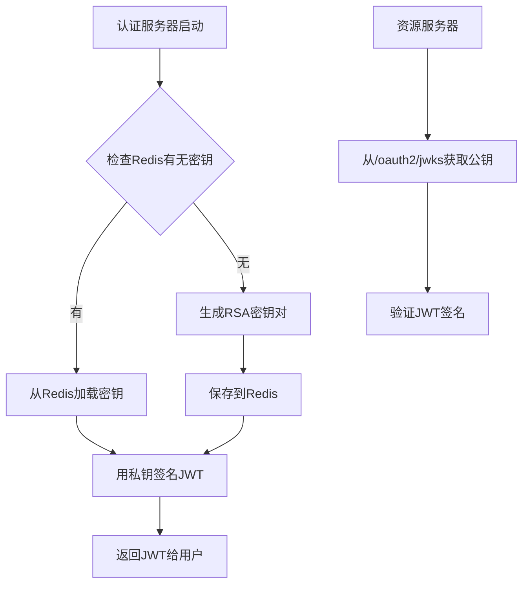
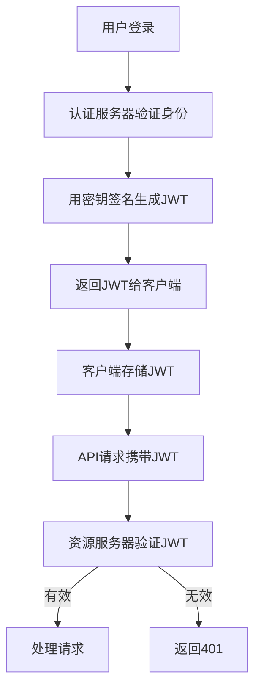

# **密钥 (Key) vs Token (令牌) - 完全不同的概念**

这是**两个完全不同的东西**，让我用最直观的方式解释：

## **1. 核心区别对比**

| 维度         | **密钥 (Key)**        | **令牌 (Token)**       |
| ------------ | --------------------- | ---------------------- |
| **是什么**   | 加密/签名用的密码钥匙 | 访问资源的通行证       |
| **使用者**   | 服务器之间使用        | 客户端持有，发给服务器 |
| **作用**     | 加密数据、验证签名    | 证明身份、授权访问     |
| **生命周期** | 长期（几个月到几年）  | 短期（几小时到几天）   |
| **数量**     | 很少（几对）          | 很多（每个用户都有）   |
| **泄露风险** | 极高（整个系统崩盘）  | 中等（单个用户受影响） |

## **2. 你的代码中两者的位置**

```
// 1. 密钥 (Key) - 存储在 Redis
@Bean
public JWKSource<SecurityContext> jwkSource() {
    // 从Redis获取JWKSet（包含公钥私钥对）
    String jwkSetStr = redisTemplate.opsForValue().get(RedisConstants.JWK_SET_KEY);
    // 这个密钥用于：JWT签名和验证
    // 位置：Redis，key是固定的
}
```

```
// 2. 令牌 (Token) - 生成后返回给客户端
public Authentication authenticate(Authentication authentication) {
    // 生成访问令牌
    OAuth2AccessToken accessToken = new OAuth2AccessToken(
        OAuth2AccessToken.TokenType.BEARER,
        generatedAccessToken.getTokenValue(),  // ← 这个是token
        generatedAccessToken.getIssuedAt(),
        generatedAccessToken.getExpiresAt()
    );
    
    // 授权记录（包含token元数据）保存到数据库
    this.authorizationService.save(authorization);
    
    // 返回token给客户端
    return new OAuth2AccessTokenAuthenticationToken(
        registeredClient, clientPrincipal,
        accessToken, refreshToken, additionalParameters
    );
}
```

## **3. 形象比喻**

### **密钥 (Key) 就像银行的印钞模板**

```
银行印钞系统：
- 密钥 = 印钞模板（只有银行有）
- 货币 = 签发的JWT令牌
- 验证 = 用模板检查货币真伪

你的系统：
- 密钥 = RSA密钥对（Redis存储）
- JWT令牌 = 签发的访问令牌
- 验证 = 用公钥验证JWT签名
```

### **令牌 (Token) 就像地铁票**

```
地铁系统：
- 地铁票 = 访问令牌
- 验票机 = 资源服务器
- 售票处 = 认证服务器
- 票务数据库 = 授权记录表
```

## **4. 技术实现流程**

### **4.1 密钥的流程（你的代码）**



### **4.2 令牌的流程**




## **5. 数据存储位置对比**

```
你的系统存储结构:

# 1. 密钥存储 (Redis) - 你的代码
键: jwk:set
值: {
  "keys": [{
    "kty": "RSA",
    "kid": "abc123",          # 密钥ID
    "n": "公钥参数n...",      # 公钥
    "e": "AQAB",             # 公钥指数
    "d": "私钥参数d...",      # 私钥 (机密!)
    "p": "...", "q": "...",  # 私钥参数
    "use": "sig"             # 用于签名
  }]
}
用途: JWT签名/验证
数量: 1-几对
生命周期: 长期

# 2. 令牌存储 (数据库/Redis) - 你问的问题
键: oauth2:authorization:{authId}
值: {
  "id": "auth_001",
  "principalName": "user123",
  "accessToken": "eyJhbGci...",  # JWT令牌
  "tokenMetadata": {...},        # 令牌元数据
  "expiresAt": "2026-01-01T12:00:00Z"
}
用途: 令牌管理/吊销
数量: 每个用户每个会话都有
生命周期: 短期
```

## **6. 为什么需要分开存储？**

### **安全要求不同**

```
// 密钥 - 最高安全级别
public class KeySecurity {
    // 必须：存储在安全的地方
    // 必须：定期轮换
    // 必须：多实例共享
    // 禁止：暴露给客户端
    // 禁止：频繁变更
}

// 令牌 - 中等安全级别
public class TokenSecurity {
    // 应该：短期有效
    // 可以：客户端存储
    // 可以：频繁颁发
    // 必须：支持吊销
    // 应该：记录日志
}
```

### **性能要求不同**

```
// 密钥查询 - 低频
@Bean
public JWKSource<SecurityContext> jwkSource() {
    // 启动时加载一次
    // 或者密钥轮换时加载
    // 频率：极低
}

// 令牌验证 - 高频
@Component
public class TokenVerification {
    // 每次API请求都验证
    // 频率：极高
    // 但JWT验证不需要查库，只需要公钥
}
```

## **7. 常见混淆场景**

### **场景1：JWT包含密钥？**

```
// ❌ 错误理解
JWT = 头部 + 载荷 + 密钥

// ✅ 正确理解
JWT = 头部 + 载荷 + 签名
签名 = 用密钥对(头部+载荷)加密的结果
验证 = 用公钥验证签名
```

### **场景2：密钥轮换 vs 令牌刷新**

```
// 密钥轮换（长期，系统级）
public void rotateJwkKeys() {
    // 生成新密钥对
    // 更新Redis中的JWKSet
    // 新令牌用新密钥签名
    // 旧密钥保留一段时间验证旧令牌
    // 频率：几个月一次
}

// 令牌刷新（短期，用户级）
public OAuth2RefreshToken refreshAccessToken(String refreshToken) {
    // 验证刷新令牌
    // 颁发新访问令牌
    // 频率：几小时一次
}
```

## **8. 你的配置是否正确？**

**✅ 完全正确！你的设计是行业最佳实践：**

1. **密钥存Redis** ✅
   - 解决集群部署问题
   - 支持密钥持久化
   - 便于密钥轮换
2. **令牌用JWT** ✅
   - 自包含，验证快
   - 不需要每次查库
   - 标准OAuth2方案
3. **授权记录存数据库** ✅
   - 管理令牌生命周期
   - 支持令牌吊销
   - 审计日志

## **总结**

| 概念         | 你的系统实现           | 是否正确   |
| ------------ | ---------------------- | ---------- |
| **密钥**     | RSA密钥对，存Redis     | ✅ 最佳实践 |
| **JWT令牌**  | 用密钥签名，客户端持有 | ✅ 标准方案 |
| **授权记录** | 存数据库，用于管理     | ✅ 合理设计 |

**简单记：**

- **密钥** = 银行的印章（只有银行有，盖在钞票上）
- **令牌** = 钞票（大家都有，用印章验证真伪）

你的代码把**密钥**存Redis，**令牌**用JWT，**授权记录**存数据库，这是**非常标准且优秀的设计**。