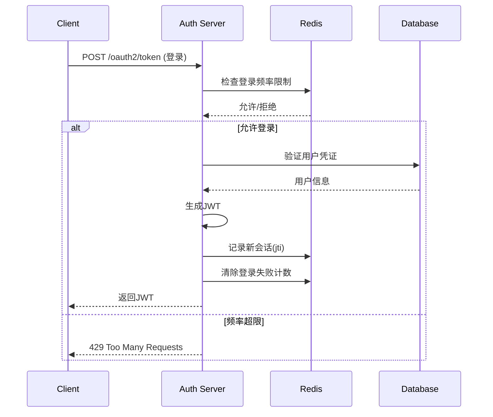

# **JWT + Redis 方案：Redis 存储的具体内容**

## **1. Redis 存储的核心内容（非完整JWT）**

### **1.1 主要存储三类数据**

```
Redis 存储结构:

# 1. 令牌吊销/黑名单管理（核心用途）
KEY: oauth2:blacklist:jti:{jti}
VALUE: "revoked" 或 "{user_id}"
TTL: 令牌剩余有效期
用途: 快速检查令牌是否被吊销
例子: oauth2:blacklist:jti:abc123 → "revoked"

# 2. 会话管理（用户活跃会话）
KEY: oauth2:sessions:user:{user_id}
VALUE: Set<jti1, jti2, jti3>
TTL: 最长会话有效期
用途: 查看用户所有活跃会话，支持强制下线
例子: oauth2:sessions:user:1001 → ["jti_abc", "jti_def"]

# 3. 频率限制/安全控制
KEY: oauth2:ratelimit:login:{ip}
VALUE: 尝试次数
TTL: 5分钟
用途: 防止暴力破解
例子: oauth2:ratelimit:login:192.168.1.1 → "3"
```

## **2. 具体实现代码**

### **2.1 Redis 黑名单服务**

```
@Component
@Slf4j
public class TokenBlacklistService {
    
    @Autowired
    private StringRedisTemplate redisTemplate;
    
    // Redis Key 前缀定义
    private static final String BLACKLIST_PREFIX = "oauth2:blacklist:jti:";
    private static final String USER_SESSIONS_PREFIX = "oauth2:sessions:user:";
    private static final String RATE_LIMIT_PREFIX = "oauth2:ratelimit:";
    
    /**
     * 吊销令牌
     */
    public void revokeToken(String jwt) {
        try {
            // 1. 从JWT中提取关键信息
            DecodedJWT decodedJWT = JWT.decode(jwt);
            String jti = decodedJWT.getId();  // JWT唯一标识
            String userId = decodedJWT.getSubject();  // 用户ID
            
            // 2. 计算剩余有效时间
            Date expiresAt = decodedJWT.getExpiresAt();
            long ttlSeconds = (expiresAt.getTime() - System.currentTimeMillis()) / 1000;
            
            if (ttlSeconds > 0) {
                // 3. 加入黑名单
                String blacklistKey = BLACKLIST_PREFIX + jti;
                redisTemplate.opsForValue().set(
                    blacklistKey, 
                    userId,  // 存储用户ID便于审计
                    ttlSeconds, 
                    TimeUnit.SECONDS
                );
                
                // 4. 从用户会话集中移除
                String userSessionsKey = USER_SESSIONS_PREFIX + userId;
                redisTemplate.opsForSet().remove(userSessionsKey, jti);
                
                log.info("令牌已吊销: jti={}, userId={}, 剩余TTL={}秒", jti, userId, ttlSeconds);
            }
        } catch (Exception e) {
            log.error("吊销令牌失败", e);
        }
    }
    
    /**
     * 检查令牌是否被吊销
     */
    public boolean isTokenRevoked(String jwt) {
        try {
            String jti = JWT.decode(jwt).getId();
            String key = BLACKLIST_PREFIX + jti;
            return Boolean.TRUE.equals(redisTemplate.hasKey(key));
        } catch (Exception e) {
            return true;  // 解析失败视为无效令牌
        }
    }
    
    /**
     * 记录新会话
     */
    public void recordNewSession(String jwt) {
        try {
            DecodedJWT decodedJWT = JWT.decode(jwt);
            String jti = decodedJWT.getId();
            String userId = decodedJWT.getSubject();
            Date expiresAt = decodedJWT.getExpiresAt();
            
            long ttlSeconds = (expiresAt.getTime() - System.currentTimeMillis()) / 1000;
            if (ttlSeconds > 0) {
                // 添加到用户会话集合
                String userSessionsKey = USER_SESSIONS_PREFIX + userId;
                redisTemplate.opsForSet().add(userSessionsKey, jti);
                redisTemplate.expire(userSessionsKey, ttlSeconds, TimeUnit.SECONDS);
            }
        } catch (Exception e) {
            log.error("记录会话失败", e);
        }
    }
    
    /**
     * 获取用户所有活跃会话
     */
    public Set<String> getUserActiveSessions(String userId) {
        String key = USER_SESSIONS_PREFIX + userId;
        return redisTemplate.opsForSet().members(key);
    }
    
    /**
     * 强制用户所有会话下线
     */
    public void revokeAllUserSessions(String userId) {
        Set<String> sessions = getUserActiveSessions(userId);
        if (sessions != null) {
            for (String jti : sessions) {
                String key = BLACKLIST_PREFIX + jti;
                // 设置24小时黑名单
                redisTemplate.opsForValue().set(key, userId, 24, TimeUnit.HOURS);
            }
        }
        // 清空会话集合
        String userSessionsKey = USER_SESSIONS_PREFIX + userId;
        redisTemplate.delete(userSessionsKey);
    }
}
```

### **2.2 登录频率限制**

```
@Component
@Slf4j
public class LoginRateLimitService {
    
    @Autowired
    private StringRedisTemplate redisTemplate;
    
    private static final int MAX_ATTEMPTS = 5;  // 5分钟内最多5次
    private static final int BLOCK_DURATION = 15;  // 锁定15分钟
    
    /**
     * 检查登录频率限制
     */
    public RateLimitResult checkLoginRateLimit(String username, String ip) {
        String userKey = "oauth2:ratelimit:login:user:" + username;
        String ipKey = "oauth2:ratelimit:login:ip:" + ip;
        
        // 1. 检查用户级别限制
        String userAttempts = redisTemplate.opsForValue().get(userKey);
        if (userAttempts != null && Integer.parseInt(userAttempts) >= MAX_ATTEMPTS) {
            return RateLimitResult.blocked("用户登录尝试过多，请稍后重试");
        }
        
        // 2. 检查IP级别限制
        String ipAttempts = redisTemplate.opsForValue().get(ipKey);
        if (ipAttempts != null && Integer.parseInt(ipAttempts) >= MAX_ATTEMPTS) {
            return RateLimitResult.blocked("IP登录尝试过多，请稍后重试");
        }
        
        return RateLimitResult.allowed();
    }
    
    /**
     * 记录登录失败
     */
    public void recordLoginFailure(String username, String ip) {
        String userKey = "oauth2:ratelimit:login:user:" + username;
        String ipKey = "oauth2:ratelimit:login:ip:" + ip;
        
        // 用户级别计数
        Long userCount = redisTemplate.opsForValue().increment(userKey);
        if (userCount == 1) {
            redisTemplate.expire(userKey, 5, TimeUnit.MINUTES);
        }
        
        // IP级别计数
        Long ipCount = redisTemplate.opsForValue().increment(ipKey);
        if (ipCount == 1) {
            redisTemplate.expire(ipKey, 5, TimeUnit.MINUTES);
        }
        
        // 如果超过限制，延长锁定时间
        if (userCount >= MAX_ATTEMPTS) {
            redisTemplate.expire(userKey, BLOCK_DURATION, TimeUnit.MINUTES);
        }
        if (ipCount >= MAX_ATTEMPTS) {
            redisTemplate.expire(ipKey, BLOCK_DURATION, TimeUnit.MINUTES);
        }
    }
    
    /**
     * 登录成功，清除计数
     */
    public void clearLoginAttempts(String username, String ip) {
        String userKey = "oauth2:ratelimit:login:user:" + username;
        String ipKey = "oauth2:ratelimit:login:ip:" + ip;
        redisTemplate.delete(userKey, ipKey);
    }
}
```

## **3. 完整流程示例**

### **3.1 用户登录流程**



### **3.2 API 访问验证流程**

```
@Component
public class JwtAuthenticationFilter extends OncePerRequestFilter {
    
    @Autowired
    private JwtDecoder jwtDecoder;
    
    @Autowired
    private TokenBlacklistService blacklistService;
    
    @Override
    protected void doFilterInternal(HttpServletRequest request, 
                                   HttpServletResponse response, 
                                   FilterChain filterChain) throws ServletException, IOException {
        
        // 1. 从请求头获取JWT
        String authHeader = request.getHeader("Authorization");
        if (authHeader != null && authHeader.startsWith("Bearer ")) {
            String jwt = authHeader.substring(7);
            
            try {
                // 2. 验证JWT签名
                Jwt decodedJwt = jwtDecoder.decode(jwt);
                
                // 3. 检查黑名单
                if (blacklistService.isTokenRevoked(jwt)) {
                    response.setStatus(HttpStatus.UNAUTHORIZED.value());
                    response.getWriter().write("Token has been revoked");
                    return;
                }
                
                // 4. 设置Spring Security认证上下文
                JwtAuthenticationToken authentication = new JwtAuthenticationToken(
                    decodedJwt, 
                    AuthorityUtils.NO_AUTHORITIES
                );
                SecurityContextHolder.getContext().setAuthentication(authentication);
                
            } catch (JwtException e) {
                // JWT验证失败
                response.setStatus(HttpStatus.UNAUTHORIZED.value());
                return;
            }
        }
        
        filterChain.doFilter(request, response);
    }
}
```

## **4. Redis 数据结构详细说明**

```
# Redis 实际存储示例：

# 1. 黑名单（哈希存储，便于管理）
HSET oauth2:blacklist jti:abc123 "{\"userId\":\"1001\",\"reason\":\"logout\",\"revokedAt\":1672531200}"
EXPIRE oauth2:blacklist:jti:abc123 3600  # 1小时后自动删除

# 2. 用户会话（集合）
SADD oauth2:sessions:user:1001 "jti:abc123" "jti:def456"
EXPIRE oauth2:sessions:user:1001 86400  # 24小时

# 3. 登录频率限制（字符串+过期）
SET oauth2:ratelimit:login:user:zhangsan "3"
EXPIRE oauth2:ratelimit:login:user:zhangsan 300  # 5分钟

# 4. 设备绑定（可选功能）
SET oauth2:device:user:1001:mobile "jti:abc123"
SET oauth2:device:user:1001:web "jti:def456"
```

## **5. 性能与存储优化**

### **5.1 内存使用估算**

```
// 100万用户，平均每人2个活跃会话
存储计算：
- 黑名单：最多 200万条 (2 * 100万)
- 每条记录：约 100字节 (jti + userId + metadata)
- 总内存：200万 * 100B ≈ 200MB

- 会话集合：100万条
- 每条：约 50字节
- 总内存：100万 * 50B ≈ 50MB

总计：约 250MB，对Redis来说很轻松
```

### **5.2 分片策略（超大系统）**

```
@Configuration
public class RedisShardingConfig {
    
    // 按用户ID分片
    public String getShardKey(String userId) {
        int shard = Math.abs(userId.hashCode()) % 16;  // 16个分片
        return "shard-" + shard;
    }
    
    // 获取对应分片的RedisTemplate
    public RedisTemplate<String, String> getShardTemplate(String userId) {
        String shardKey = getShardKey(userId);
        return shardTemplates.get(shardKey);
    }
}
```

## **6. 监控与管理**

### **6.1 Redis 监控指标**

```
@Component
public class RedisTokenMetrics {
    
    @Autowired
    private StringRedisTemplate redisTemplate;
    
    // 监控指标
    @Scheduled(fixedDelay = 60000)  // 每分钟采集
    public void collectMetrics() {
        // 1. 活跃会话数
        Long activeSessions = redisTemplate.keys("oauth2:sessions:user:*").stream()
            .map(key -> redisTemplate.opsForSet().size(key))
            .reduce(0L, Long::sum);
        
        // 2. 黑名单条目数
        Long blacklistCount = redisTemplate.keys("oauth2:blacklist:jti:*").size();
        
        // 3. 登录失败统计
        Long failedAttempts = redisTemplate.keys("oauth2:ratelimit:login:*").stream()
            .map(key -> Long.parseLong(redisTemplate.opsForValue().get(key)))
            .reduce(0L, Long::sum);
        
        // 发送到监控系统
        Metrics.gauge("oauth2.sessions.active", activeSessions);
        Metrics.gauge("oauth2.blacklist.size", blacklistCount);
        Metrics.gauge("oauth2.login.failures", failedAttempts);
    }
}
```

## **7. 总结：Redis 存储的内容**

| 存储内容       | Key 示例                               | Value 示例            | 用途         |
| -------------- | -------------------------------------- | --------------------- | ------------ |
| **黑名单**     | `oauth2:blacklist:jti:abc123`          | `"1001"`              | 快速吊销检查 |
| **用户会话**   | `oauth2:sessions:user:1001`            | `["abc123","def456"]` | 会话管理     |
| **登录频率**   | `oauth2:ratelimit:login:user:zhangsan` | `"3"`                 | 防止暴力破解 |
| **设备绑定**   | `oauth2:device:user:1001:mobile`       | `"abc123"`            | 设备管理     |
| **验证码**     | `oauth2:captcha:{key}`                 | `"123456"`            | 图形验证码   |
| **短信验证码** | `oauth2:sms:{phone}`                   | `"654321"`            | 短信验证     |

**记住：**

- **✅ Redis 存的是元数据和状态**，不是完整JWT
- **✅ JWT 只在客户端存储**，服务端不存
- **✅ Redis 用于解决JWT的吊销问题**
- **✅ Redis 用于增强安全和管理能力**

**你的任务：**

1. 实现 `TokenBlacklistService`管理令牌吊销
2. 在资源服务器JWT验证时检查黑名单
3. 添加登录频率限制
4. 实现会话管理接口