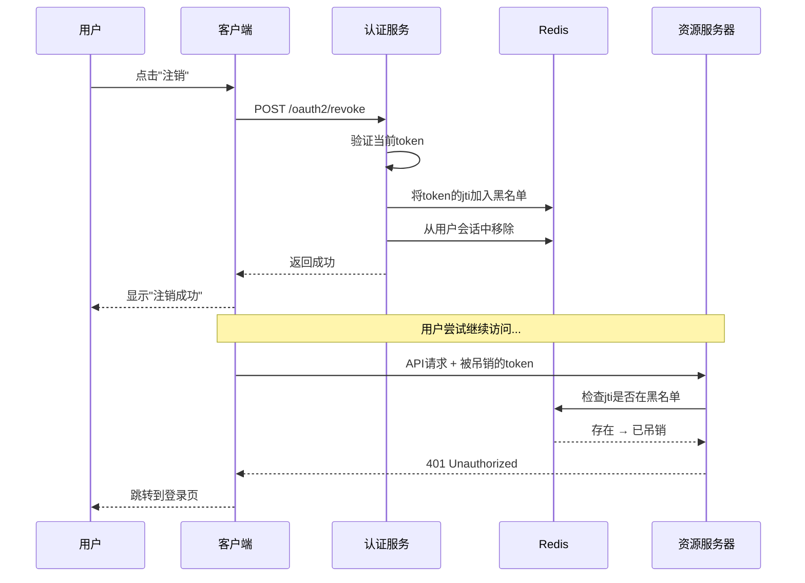

# **Redis 黑名单控制 Token 的完整机制**

让我详细解释 Redis 黑名单如何实现对 JWT 令牌的控制：

## **1. 核心原理：JWT 的不可撤销性缺陷**

### **1.1 JWT 的先天缺陷**

```
// JWT 是自包含的，这是优点也是缺点
String jwt = "header.payload.signature";

// 资源服务器验证：
1. 验证签名 ✅ (用公钥)
2. 检查过期时间 ✅ (payload里有)
3. 但无法知道：用户是否已注销 ❌
4. 无法知道：令牌是否被管理员吊销 ❌
```

### **1.2 Redis 黑名单解决之道**

```
// 解决方案：额外检查
@Bean
public SecurityFilterChain resourceServerFilterChain(HttpSecurity http) {
    http.oauth2ResourceServer(oauth2 -> oauth2
        .jwt(jwt -> jwt
            .jwtAuthenticationConverter(jwt -> {
                // 1. 先验证JWT签名（Spring Security自动做）
                // 2. 再检查Redis黑名单
                if (blacklistService.isTokenRevoked(jwt.getTokenValue())) {
                    throw new JwtException("Token has been revoked");
                }
                return convertJwt(jwt);
            })
        )
    );
    return http.build();
}
```

## **2. 黑名单的完整实现**

### **2.1 核心服务类**

```
@Component
@Slf4j
public class TokenBlacklistService {
    
    @Autowired
    private StringRedisTemplate redisTemplate;
    
    // Redis Key 模式
    private static final String BLACKLIST_KEY_PREFIX = "oauth2:blacklist:";
    private static final String SESSIONS_KEY_PREFIX = "oauth2:sessions:";
    
    /**
     * 吊销单个令牌
     */
    public boolean revokeToken(String jwtToken) {
        try {
            DecodedJWT decodedJWT = JWT.decode(jwtToken);
            String jti = decodedJWT.getId();  // JWT唯一标识
            String userId = decodedJWT.getSubject();
            Date expiresAt = decodedJWT.getExpiresAt();
            
            // 计算剩余有效期（秒）
            long ttlSeconds = Math.max(0, 
                (expiresAt.getTime() - System.currentTimeMillis()) / 1000);
            
            if (ttlSeconds > 0) {
                // 存储到黑名单
                String blacklistKey = BLACKLIST_KEY_PREFIX + jti;
                
                // 存储令牌信息（JSON格式）
                TokenInfo tokenInfo = new TokenInfo(
                    userId, 
                    jwtToken,  // 可选：存储部分信息用于审计
                    "USER_LOGOUT",
                    System.currentTimeMillis(),
                    ttlSeconds
                );
                
                ObjectMapper mapper = new ObjectMapper();
                String tokenInfoJson = mapper.writeValueAsString(tokenInfo);
                
                redisTemplate.opsForValue().set(
                    blacklistKey, 
                    tokenInfoJson, 
                    ttlSeconds,  // 自动过期
                    TimeUnit.SECONDS
                );
                
                // 从用户会话集中移除
                removeFromUserSessions(userId, jti);
                
                log.info("令牌已加入黑名单: jti={}, userId={}, ttl={}s", jti, userId, ttlSeconds);
                return true;
            }
        } catch (Exception e) {
            log.error("吊销令牌失败", e);
        }
        return false;
    }
    
    /**
     * 检查令牌是否被吊销
     */
    public boolean isTokenRevoked(String jwtToken) {
        try {
            String jti = JWT.decode(jwtToken).getId();
            String blacklistKey = BLACKLIST_KEY_PREFIX + jti;
            
            // 检查Redis中是否存在这个key
            Boolean exists = redisTemplate.hasKey(blacklistKey);
            return Boolean.TRUE.equals(exists);
            
        } catch (Exception e) {
            // 如果JWT解析失败，视为无效令牌
            return true;
        }
    }
    
    /**
     * 吊销用户的所有令牌
     */
    public int revokeAllUserTokens(String userId) {
        int revokedCount = 0;
        
        // 1. 获取用户所有活跃会话
        String sessionsKey = SESSIONS_KEY_PREFIX + "user:" + userId;
        Set<String> jtiSet = redisTemplate.opsForSet().members(sessionsKey);
        
        if (jtiSet != null) {
            for (String jti : jtiSet) {
                // 加入黑名单（设置较长TTL）
                String blacklistKey = BLACKLIST_KEY_PREFIX + jti;
                redisTemplate.opsForValue().set(
                    blacklistKey, 
                    "revoked_by_admin", 
                    24,  // 24小时
                    TimeUnit.HOURS
                );
                revokedCount++;
            }
            
            // 2. 清空用户会话
            redisTemplate.delete(sessionsKey);
        }
        
        log.info("已吊销用户所有令牌: userId={}, count={}", userId, revokedCount);
        return revokedCount;
    }
    
    /**
     * 记录新会话
     */
    public void recordNewSession(String jwtToken) {
        try {
            DecodedJWT decodedJWT = JWT.decode(jwtToken);
            String jti = decodedJWT.getId();
            String userId = decodedJWT.getSubject();
            Date expiresAt = decodedJWT.getExpiresAt();
            
            long ttlSeconds = (expiresAt.getTime() - System.currentTimeMillis()) / 1000;
            if (ttlSeconds > 0) {
                // 添加到用户会话集合
                String sessionsKey = SESSIONS_KEY_PREFIX + "user:" + userId;
                redisTemplate.opsForSet().add(sessionsKey, jti);
                redisTemplate.expire(sessionsKey, ttlSeconds, TimeUnit.SECONDS);
            }
        } catch (Exception e) {
            log.error("记录会话失败", e);
        }
    }
    
    /**
     * 从用户会话中移除
     */
    private void removeFromUserSessions(String userId, String jti) {
        String sessionsKey = SESSIONS_KEY_PREFIX + "user:" + userId;
        redisTemplate.opsForSet().remove(sessionsKey, jti);
    }
    
    /**
     * 黑名单信息
     */
    @Data
    @AllArgsConstructor
    @NoArgsConstructor
    static class TokenInfo {
        private String userId;
        private String tokenHash;  // 存储token的哈希值
        private String revokeReason;  // 吊销原因
        private Long revokedAt;  // 吊销时间戳
        private Long ttlSeconds;  // 剩余有效期
    }
}
```

### **2.2 资源服务器的验证过滤器**

```
@Component
public class JwtBlacklistFilter extends OncePerRequestFilter {
    
    @Autowired
    private TokenBlacklistService blacklistService;
    
    @Override
    protected void doFilterInternal(HttpServletRequest request, 
                                   HttpServletResponse response, 
                                   FilterChain filterChain) throws ServletException, IOException {
        
        // 1. 获取Authorization头
        String authHeader = request.getHeader("Authorization");
        
        if (authHeader != null && authHeader.startsWith("Bearer ")) {
            String jwtToken = authHeader.substring(7);
            
            // 2. 检查黑名单
            if (blacklistService.isTokenRevoked(jwtToken)) {
                // 返回标准的OAuth2错误响应
                response.setStatus(HttpStatus.UNAUTHORIZED.value());
                response.setContentType(MediaType.APPLICATION_JSON_VALUE);
                
                OAuth2Error error = new OAuth2Error(
                    "invalid_token",
                    "The access token was revoked",
                    "https://tools.ietf.org/html/rfc6750#section-3.1"
                );
                
                ObjectMapper mapper = new ObjectMapper();
                response.getWriter().write(mapper.writeValueAsString(error));
                return;
            }
        }
        
        // 3. 继续过滤器链
        filterChain.doFilter(request, response);
    }
}
```

## **3. 集成到 Spring Security**

### **3.1 资源服务器配置**

```
@Configuration
@EnableWebSecurity
public class ResourceServerConfig {
    
    @Autowired
    private TokenBlacklistService blacklistService;
    
    @Bean
    public SecurityFilterChain resourceServerFilterChain(HttpSecurity http) throws Exception {
        
        http
            .authorizeHttpRequests(authorize -> authorize
                .requestMatchers("/api/public/**").permitAll()
                .anyRequest().authenticated()
            )
            .oauth2ResourceServer(oauth2 -> oauth2
                .jwt(jwt -> jwt
                    .jwtAuthenticationConverter(jwtAuthenticationConverter())
                )
            )
            .addFilterBefore(new JwtBlacklistFilter(), BearerTokenAuthenticationFilter.class);
        
        return http.build();
    }
    
    /**
     * 自定义JWT认证转换器
     */
    private JwtAuthenticationConverter jwtAuthenticationConverter() {
        JwtAuthenticationConverter converter = new JwtAuthenticationConverter();
        
        converter.setJwtGrantedAuthoritiesConverter(jwt -> {
            // 1. 验证JWT签名后，检查黑名单
            if (blacklistService.isTokenRevoked(jwt.getTokenValue())) {
                throw new JwtValidationException("Token has been revoked");
            }
            
            // 2. 提取权限
            Collection<String> scopes = jwt.getClaimAsStringList("scope");
            if (scopes == null) {
                scopes = Collections.emptyList();
            }
            
            return scopes.stream()
                .map(scope -> new SimpleGrantedAuthority("SCOPE_" + scope))
                .collect(Collectors.toList());
        });
        
        return converter;
    }
}
```

## **4. 完整的控制流程**

### **4.1 用户注销流程**




### **4.2 管理员吊销用户所有令牌**

```
@RestController
@RequestMapping("/admin/tokens")
@PreAuthorize("hasRole('ADMIN')")
public class AdminTokenController {
    
    @Autowired
    private TokenBlacklistService blacklistService;
    
    /**
     * 强制用户下线
     */
    @PostMapping("/{userId}/revoke-all")
    public ResponseEntity<?> revokeAllUserTokens(@PathVariable String userId) {
        int revokedCount = blacklistService.revokeAllUserTokens(userId);
        
        return ResponseEntity.ok(Map.of(
            "success", true,
            "userId", userId,
            "revokedCount", revokedCount,
            "message", "用户所有令牌已被吊销"
        ));
    }
    
    /**
     * 查看用户活跃会话
     */
    @GetMapping("/{userId}/sessions")
    public ResponseEntity<?> getUserSessions(@PathVariable String userId) {
        // 实现获取用户会话的方法
        List<SessionInfo> sessions = blacklistService.getUserSessions(userId);
        
        return ResponseEntity.ok(Map.of(
            "userId", userId,
            "activeSessions", sessions.size(),
            "sessions", sessions
        ));
    }
}
```

## **5. Redis 数据结构详解**

### **5.1 黑名单数据结构**

```
# Redis 中的实际数据示例：

# 1. 黑名单条目 (String类型)
# KEY: oauth2:blacklist:{jti}
# VALUE: JSON格式的令牌信息
SET oauth2:blacklist:abc123 '{"userId":"1001","tokenHash":"sha256_xxxx","revokeReason":"user_logout","revokedAt":1672531200,"ttlSeconds":3600}'
EXPIRE oauth2:blacklist:abc123 3600  # 1小时后自动删除

# 2. 用户会话集合 (Set类型)
# KEY: oauth2:sessions:user:{userId}
# VALUE: 该用户的所有活跃jti
SADD oauth2:sessions:user:1001 "abc123" "def456" "ghi789"
EXPIRE oauth2:sessions:user:1001 86400  # 24小时

# 3. 可选：按设备存储
# KEY: oauth2:device:{userId}:{deviceId}
# VALUE: 设备对应的jti
SET oauth2:device:1001:iphone-12 "abc123"
EXPIRE oauth2:device:1001:iphone-12 86400
```

### **5.2 性能考虑**

```
// 每次API请求的Redis操作：
public class PerformanceMetrics {
    
    // 检查黑名单：1次GET操作
    // 时间复杂度：O(1) 常量时间
    // 网络开销：通常 < 1ms (同机房)
    
    // 1000 QPS 时的Redis负载：
    // 每秒 1000 次 GET 操作
    // Redis 可轻松处理 10万+ QPS
    
    // 内存占用估算：
    // 100万用户，平均每人2个活跃令牌
    // 每个黑名单条目：~200字节
    // 总内存：200万 * 200B ≈ 400MB
}
```

## **6. 高级特性实现**

### **6.1 增量吊销（Partial Revocation）**

```
/**
 * 只吊销特定范围的令牌
 */
public class AdvancedBlacklistService {
    
    /**
     * 只吊销web端的令牌，保留移动端
     */
    public int revokeTokensByDeviceType(String userId, String deviceType) {
        // 1. 获取用户所有会话
        Set<String> allJtis = getUserAllJtis(userId);
        int revoked = 0;
        
        for (String jti : allJtis) {
            // 2. 检查设备类型（需要存储额外信息）
            String deviceKey = "oauth2:device:info:" + jti;
            String deviceInfo = redisTemplate.opsForValue().get(deviceKey);
            
            if (deviceInfo != null && deviceInfo.contains(deviceType)) {
                // 3. 只吊销匹配设备类型的令牌
                revokeTokenByJti(jti);
                revoked++;
            }
        }
        
        return revoked;
    }
}
```

### **6.2 令牌使用统计**

```
/**
 * 监控令牌使用情况
 */
@Component
public class TokenUsageTracker {
    
    @Autowired
    private StringRedisTemplate redisTemplate;
    
    /**
     * 记录令牌使用
     */
    public void recordTokenUsage(String jwtToken, HttpServletRequest request) {
        try {
            String jti = JWT.decode(jwtToken).getId();
            String userId = JWT.decode(jwtToken).getSubject();
            
            // 记录使用次数
            String usageKey = "oauth2:usage:jti:" + jti;
            redisTemplate.opsForValue().increment(usageKey);
            
            // 记录最后使用时间
            String lastUsedKey = "oauth2:lastused:jti:" + jti;
            redisTemplate.opsForValue().set(
                lastUsedKey, 
                String.valueOf(System.currentTimeMillis())
            );
            
            // 记录访问路径
            String pathKey = "oauth2:access:path:" + jti;
            redisTemplate.opsForList().leftPush(pathKey, request.getRequestURI());
            redisTemplate.opsForList().trim(pathKey, 0, 9);  // 保留最近10条
            
        } catch (Exception e) {
            log.error("记录令牌使用失败", e);
        }
    }
}
```

## **7. 部署和监控**

### **7.1 多环境配置**

```
# application.yml
spring:
  data:
    redis:
      # 生产环境
      host: ${REDIS_HOST:localhost}
      port: ${REDIS_PORT:6379}
      password: ${REDIS_PASSWORD:}
      database: 0
      
      # 连接池配置
      lettuce:
        pool:
          max-active: 8
          max-idle: 8
          min-idle: 0
          max-wait: -1ms
          time-between-eviction-runs: 60s

# 黑名单配置
oauth2:
  blacklist:
    enabled: true
    prefix: "oauth2:blacklist:"
    # 生产环境可设置更长的备份时间
    backup-ttl-hours: 24
    # 是否启用会话管理
    session-management: true
```

### **7.2 监控指标**

```
@Component
public class BlacklistMetrics {
    
    @Autowired
    private StringRedisTemplate redisTemplate;
    
    // 监控指标
    @Scheduled(fixedRate = 60000)  // 每分钟
    public void collectMetrics() {
        // 1. 黑名单大小
        Long blacklistSize = redisTemplate.keys("oauth2:blacklist:*").size();
        
        // 2. 活跃会话数
        Set<String> sessionKeys = redisTemplate.keys("oauth2:sessions:user:*");
        Long totalSessions = sessionKeys.stream()
            .map(key -> redisTemplate.opsForSet().size(key))
            .reduce(0L, Long::sum);
        
        // 3. 发送到监控系统
        Metrics.gauge("oauth2.blacklist.size", blacklistSize);
        Metrics.gauge("oauth2.sessions.active", totalSessions);
        
        log.debug("黑名单监控: 黑名单条目={}, 活跃会话={}", blacklistSize, totalSessions);
    }
}
```

## **8. 注意事项**

### **8.1 重要提醒**

```
注意事项:

1. **TTL管理**: 黑名单的TTL应该略大于JWT的过期时间
   - 避免在过期前一刻吊销，然后立即失效的问题

2. **Redis高可用**: 必须配置Redis集群或哨兵
   - Redis宕机 = 黑名单失效 = 安全漏洞

3. **性能影响**: 每次API请求增加1次Redis查询
   - 确保Redis和应用的网络延迟低

4. **内存管理**: 监控Redis内存使用
   - 设置合理的maxmemory策略

5. **数据一致性**: 考虑分布式锁
   - 多实例同时吊销时的竞争条件
```

### **8.2 故障处理**

```
@Component
public class BlacklistFallbackHandler {
    
    /**
     * Redis宕机时的降级策略
     */
    public boolean isTokenRevoked(String jwtToken) {
        try {
            // 1. 先尝试Redis
            return blacklistService.isTokenRevoked(jwtToken);
        } catch (RedisConnectionFailureException e) {
            log.error("Redis连接失败，使用本地缓存降级", e);
            
            // 2. 降级：使用本地缓存（有限）
            String jti = extractJti(jwtToken);
            return localCache.containsKey(jti);
            
            // 3. 或者：严格模式，Redis宕机时拒绝所有请求
            // return true;  // 所有令牌视为吊销
        }
    }
}
```

## **总结**

Redis 黑名单控制 Token 的核心是：

1. **存储jti到Redis**，设置与JWT相同的TTL
2. **每次验证JWT时**，额外检查Redis黑名单
3. **用户注销/管理员操作**时，将jti加入黑名单
4. **自动过期清理**，Redis自动删除过期条目

**你的系统只需添加这个黑名单检查，就能完美解决JWT无法吊销的问题！**