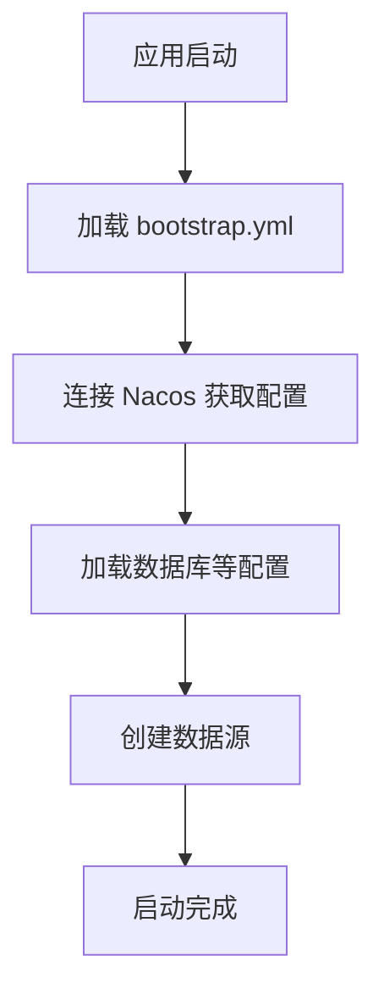
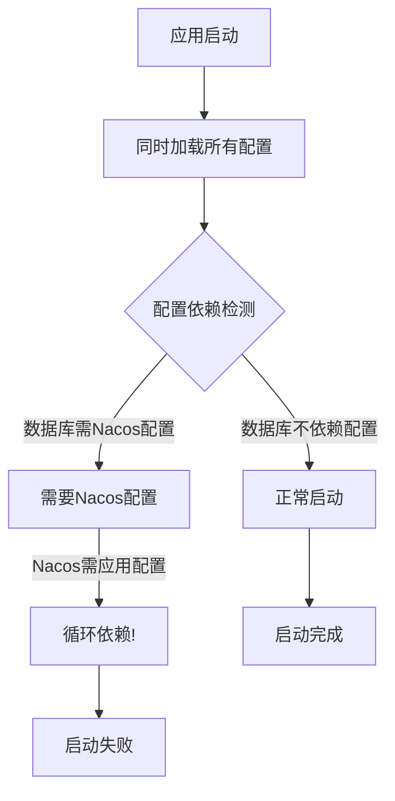

Spring Boot 2.x vs 3.x 的配置加载差异

### Spring Boot 2.x 的启动流程




**关键特点**：

1. **有 `bootstrap.yml`**：优先加载，专门用于外部配置
2. **两阶段加载**：先加载外部配置，再加载应用配置
3. **自动延迟**：数据源等 Bean 在配置加载后创建
4. **顺序明确**：不会出现循环依赖

### Spring Boot 3.x 的启动流程




**关键变化**：

1. **移除 `bootstrap.yml`**：统一使用 `application.yml`
2. **单阶段加载**：所有配置同时加载
3. **强类型检查**：对配置依赖更严格
4. **循环依赖检测**：立即失败而不是延迟

## 为什么 3.x 会有问题？

### 1. **配置加载顺序改变**

- **2.x**：`bootstrap.yml`→ Nacos配置 → 数据库配置
- **3.x**：所有配置同时加载，可能导致循环依赖

### 2. **`spring.config.import`的要求**

- **2.x**：可选，自动发现
- **3.x**：**强制**，必须显式声明

### 3. **即时失败策略**

- **2.x**：可能延迟失败，启动后报错
- **3.x**：启动时立即失败，更严格

## 如何在 3.x 中实现 2.x 的效果？

### 方案一：恢复 bootstrap 机制（不推荐）

```
<!-- 添加依赖 -->
<dependency>
    <groupId>org.springframework.cloud</groupId>
    <artifactId>spring-cloud-starter-bootstrap</artifactId>
</dependency>
```

```
# bootstrap.yml
spring:
  application:
    name: aioveu-lss
  cloud:
    nacos:
      config:
        server-addr: localhost:8848
```

### 方案二：使用新的配置方式（推荐）

```
# application.yml
spring:
  application:
    name: aioveu-lss
  
  # 延迟数据源初始化
  autoconfigure:
    exclude:
      - org.springframework.boot.autoconfigure.jdbc.DataSourceAutoConfiguration
  
  # 先加载 Nacos 配置
  config:
    import:
      - optional:nacos:${spring.application.name}.yaml
  
  cloud:
    nacos:
      config:
        server-addr: localhost:8848
        import-check:
          enabled: false
```

### 方案三：手动控制 Bean 创建顺序

```
@Configuration
public class DelayedDataSourceConfig {
    
    // 延迟创建数据源
    @Bean
    @DependsOn("nacosConfigService")  // 依赖 Nacos 配置服务
    public DataSource dataSource(
            @Value("${spring.datasource.url}") String url) {
        // 从 Nacos 加载的配置创建数据源
        return DataSourceBuilder.create()
            .url(url)
            .build();
    }
}
```

## 2.x 迁移到 3.x 的检查清单

1. **移除 `bootstrap.yml`** → 合并到 `application.yml`
2. **添加 `spring.config.import`** → 显式声明 Nacos 配置
3. **处理循环依赖** → 延迟数据源初始化
4. **更新版本** → 使用兼容的 Spring Cloud Alibaba
5. **测试配置加载** → 确保顺序正确

## 您之前的 2.x 配置可能是这样的：

```
# bootstrap.yml
spring:
  application:
    name: aioveu-lss
  cloud:
    nacos:
      config:
        server-addr: localhost:8848
        file-extension: yaml
```

```
# application.yml
spring:
  datasource:
    url: ${mysql.url}  # 从 Nacos 获取
    # ...
```

## 对应的 3.x 配置：

```
# application.yml
spring:
  application:
    name: aioveu-lss
  
  config:
    import: optional:nacos:${spring.application.name}.yaml
  
  autoconfigure:
    exclude:
      - org.springframework.boot.autoconfigure.jdbc.DataSourceAutoConfiguration
  
  cloud:
    nacos:
      config:
        server-addr: localhost:8848
        import-check:
          enabled: false
```

## 总结

**Spring Boot 3.x 更严格、更明确**：

- ✅ 必须显式声明配置来源
- ✅ 立即报告配置问题
- ❌ 不允许模糊的配置加载
- ❌ 不允许循环依赖

您需要**重构配置加载逻辑**，而不是简单迁移配置文件。这就是为什么 2.x 能工作，3.x 会报错的原因。