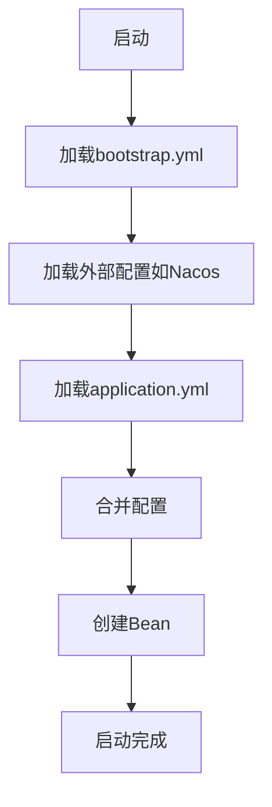
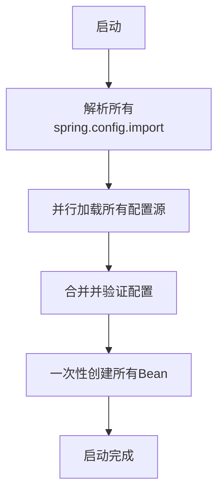

## Spring Boot 2.x vs 3.x 的设计哲学变化

### Spring Boot 2.x 的方式（顺序加载）




**优点**：

- 符合直觉，顺序清晰
- 外部配置优先加载
- 逐步解决依赖

**缺点**：

- 启动过程复杂
- 调试困难
- 配置优先级混乱

### Spring Boot 3.x 的方式（声明式加载）




## 为什么改成声明式加载？

### 1. **性能优化**

- 并行加载配置，加快启动速度
- 减少配置解析的来回切换

### 2. **简化配置模型**

- 统一的配置导入机制
- 不再需要特殊的 `bootstrap.yml`
- 所有配置源平等对待

### 3. **更强的类型安全**

```
# 2.x：模糊的配置来源
# 不知道配置从哪里来

# 3.x：明确的配置来源
spring:
  config:
    import:
      - optional:nacos:app.yaml  # 明确来自Nacos
      - configtree:/config/      # 明确来自文件树
      - vault://secret/myapp     # 明确来自Vault
```

### 4. **更好的错误处理**

- 启动时就报告所有配置问题
- 而不是运行时才发现配置缺失

## 实际例子对比

### Spring Boot 2.x

```
# bootstrap.yml
spring:
  cloud:
    nacos:
      config:
        server-addr: localhost:8848

# application.yml
spring:
  datasource:
    url: ${mysql.url}  # 从Nacos获取
```

**问题**：如果 Nacos 连不上，启动时会卡住或报错不明确。

### Spring Boot 3.x

```
# application.yml
spring:
  config:
    import: optional:nacos:app.yaml
  
  cloud:
    nacos:
      config:
        server-addr: localhost:8848
```

**改进**：

- 明确的失败原因
- 可选的配置（`optional:`前缀）
- 清晰的配置来源

## 如何解决您的问题？

### 正确的 3.x 配置模式

```
spring:
  application:
    name: aioveu-lss
  
  # 声明式配置：先声明，后使用
  config:
    import:
      - optional:nacos:${spring.application.name}.yaml
  
  # 配置源的定义
  cloud:
    nacos:
      config:
        server-addr: 127.0.0.1:8848
        namespace: public
```

### 关键理解

1. **`spring.config.import`是声明**，不是执行顺序
2. **Spring 会智能解析依赖**
3. **配置可以来自多个源，同时加载**

## 为什么您觉得应该顺序加载？

因为您习惯了 2.x 的**命令式**思维：

1. 先做 A
2. 然后做 B
3. 最后做 C

但 3.x 是**声明式**思维：

```
# 我需要的配置：
# 1. 来自 Nacos
# 2. 来自本地文件
# 3. 系统帮我搞定依赖
spring:
  config:
    import:
      - optional:nacos:app.yaml
      - classpath:local.yml
```

## 实际解决方案

对于您的场景，应该这样配置：

```
spring:
  application:
    name: aioveu-lss
  
  # 声明：我需要这些配置
  config:
    import:
      - optional:nacos:aioveu-lss.yaml?namespace=public&group=DEFAULT_GROUP
  
  # 配置源的元信息
  cloud:
    nacos:
      config:
        server-addr: 127.0.0.1:8848
        # 这些是给 Nacos 客户端用的，不是给配置加载器用的
        namespace: public
        group: DEFAULT_GROUP
  
  # 本地配置（优先级最高）
  mail:
    host: smtp.qq.com
    port: 587
    username: ambitiouschild@qq.com
    password: pwjbkmmfmuspdgjh
```

## 验证这个配置是否工作

请用这个最简单配置测试：

```
server:
  port: 9999

spring:
  application:
    name: aioveu-lss
  
  # 关键：optional 表示即使 Nacos 连不上也能启动
  config:
    import: optional:nacos:aioveu-lss.yaml
  
  # 必须的 Nacos 连接信息
  cloud:
    nacos:
      config:
        server-addr: 127.0.0.1:8848
        namespace: public
        import-check:
          enabled: false
  
  mail:
    host: smtp.qq.com
    port: 587
    username: ambitiouschild@qq.com
    password: pwjbkmmfmuspdgjh
    properties:
      mail:
        smtp:
          auth: true
          ssl: true
          starttls:
            enable: true
    from: ambitiouschild@qq.com
```

## 总结

**Spring Boot 3.x 的设计理念**：

- ✅ 声明式配置，非命令式
- ✅ 并行加载，非顺序加载
- ✅ 明确配置来源，非隐式加载
- ✅ 启动时验证，非运行时才发现

这确实是个学习曲线，但一旦适应，配置会更清晰、更健壮。
