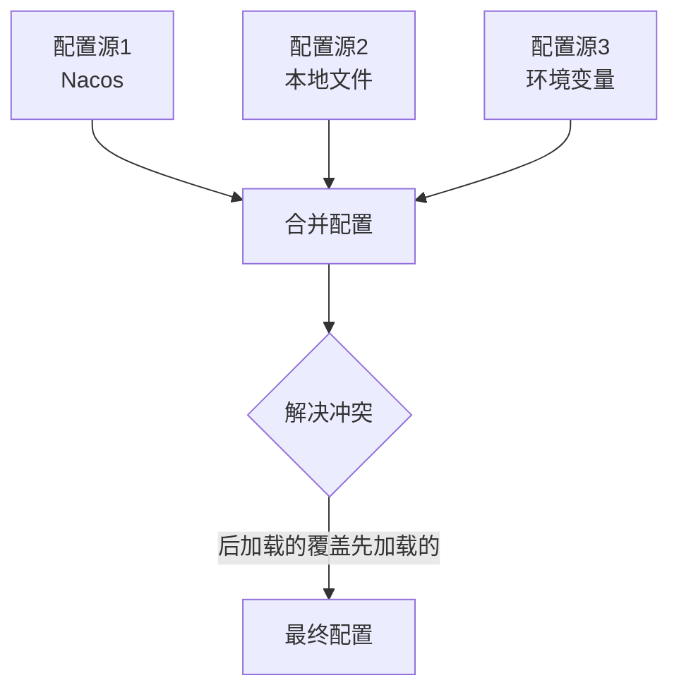

问得好！Spring Boot 3.x 并不是完全不管加载顺序，而是采用**不同的机制**来处理。让我详细解释：

## 并行加载 vs 配置优先级

### 1. **并行加载配置源，但合并时有顺序**




### 2. **明确的配置优先级规则**

Spring Boot 3.x 的优先级规则（从低到高）：

```
1. 默认属性
2. @Configuration 类上的 @PropertySource
3. 配置数据（如 application.yml）
4. RandomValuePropertySource
5. OS 环境变量
6. Java 系统属性
7. ServletContext 初始化参数
8. ServletConfig 初始化参数
9. SPRING_APPLICATION_JSON
10. 命令行参数
```

## 关键变化：配置数据的加载

在 Spring Boot 2.x 中，配置数据是**顺序加载**：

```
bootstrap.yml → application.yml → application-{profile}.yml
```

在 Spring Boot 3.x 中，配置数据是**声明式加载**：

```
spring:
  config:
    import:
      - optional:nacos:app.yaml      # 外部配置
      - classpath:application.yml    # 主配置
      - classpath:application-dev.yml # 环境配置
```

## 如何控制"顺序"？

### 方案一：通过 `spring.config.import`的顺序

```
spring:
  config:
    import:
      - classpath:base.yml      # 先加载
      - optional:nacos:db.yml   # 然后加载
      - classpath:override.yml  # 最后加载，可以覆盖前面的
```

**后导入的配置会覆盖先导入的配置**。

### 方案二：通过 `spring.config.activate.on-profile`

```
# application.yml
spring:
  config:
    import:
      - classpath:common.yml
  profiles:
    active: dev
```

```
# common.yml
app:
  name: default
---
spring:
  config:
    activate:
      on-profile: dev
  app:
    name: dev-app
---
spring:
  config:
    activate:
      on-profile: prod  
  app:
    name: prod-app
```

### 方案三：通过配置数据优先级

```
# 配置树
/
├── config/
│   ├── application.yml           # 最低优先级
│   └── application-dev.yml       # 更高优先级
├── application.yml               # 更高优先级
└── application-dev.yml           # 最高优先级
```

## 您的场景如何解决？

### 您期望的顺序：

1. 加载本地配置（知道Nacos地址）
2. 连接Nacos
3. 加载Nacos配置
4. 合并配置

### Spring Boot 3.x 的实际处理：

```
spring:
  # 声明：我需要这些配置
  config:
    import:
      - optional:nacos:${spring.application.name}.yaml
  
  # 提供Nacos连接信息
  cloud:
    nacos:
      config:
        server-addr: 127.0.0.1:8848
  
  # 本地配置
  application:
    name: aioveu-lss
```

Spring 会：

1. 解析整个配置
2. 发现需要从 Nacos 加载配置
3. 使用已提供的 `server-addr`连接 Nacos
4. 获取并合并配置

## 并行加载的优势

### 场景：多个配置源

```
spring:
  config:
    import:
      - nacos:app.yaml           # 微服务配置
      - vault://secrets/db       # 数据库密码
      - s3://config/app.yml      # 对象存储配置
      - classpath:local.yml      # 本地配置
```

**并行加载**：同时从4个源获取配置

**顺序加载**：串行从4个源获取配置（更慢）

## 配置冲突解决示例

```
# nacos:app.yaml
server:
  port: 8080
database:
  url: jdbc:mysql://prod:3306/db

# classpath:application.yml  
spring:
  config:
    import: optional:nacos:app.yaml
server:
  port: 9999  # 这个会覆盖Nacos的8080
```

结果：`server.port=9999`（本地覆盖远程）

## 验证配置顺序

创建测试类：

```
@Component
@Slf4j
public class ConfigOrderChecker {
    
    // 查看所有配置源
    @Autowired
    private Environment environment;
    
    @PostConstruct
    public void check() {
        if (environment instanceof ConfigurableEnvironment) {
            ConfigurableEnvironment env = (ConfigurableEnvironment) environment;
            for (PropertySource<?> source : env.getPropertySources()) {
                log.info("Config Source: {} -> {}", source.getName(), source.getClass());
            }
        }
        
        // 查看实际值
        log.info("server.port = {}", environment.getProperty("server.port"));
        log.info("spring.application.name = {}", 
                 environment.getProperty("spring.application.name"));
    }
}
```

## 您的问题解决方案

### 正确的配置方式

```
# application.yml
spring:
  application:
    name: aioveu-lss
  profiles:
    active: dev
  
  # 声明配置来源
  config:
    import:
      - optional:nacos:aioveu-lss.yaml
  
  # 提供Nacos连接信息
  cloud:
    nacos:
      config:
        server-addr: 127.0.0.1:8848
        namespace: public
        import-check:
          enabled: false
  
  # 本地配置
  mail:
    host: smtp.qq.com
    # ...
```

### 在Nacos中

```
# aioveu-lss.yaml
spring:
  datasource:
    url: jdbc:mysql://localhost:3306/aioveu_lss
    username: root
    password: 123456
```

## 总结

Spring Boot 3.x 的**并行加载**不是没有顺序，而是：

1. **配置源并行加载**（性能优化）
2. **配置合并有明确优先级**（后加载的覆盖先加载的）
3. **依赖关系自动解析**（不需要手动控制顺序）
4. **声明式配置**（更清晰，更易于维护）

您的"顺序加载"需求，在 3.x 中通过**配置优先级**和**optional前缀**来实现，而不是通过执行顺序。