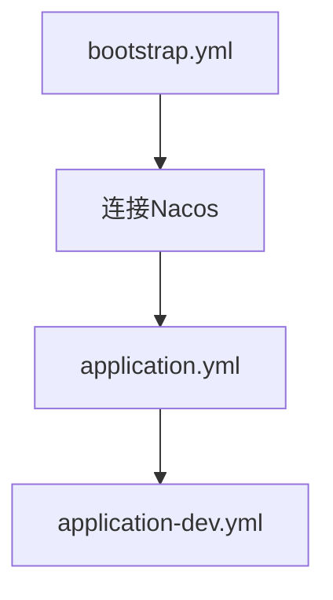
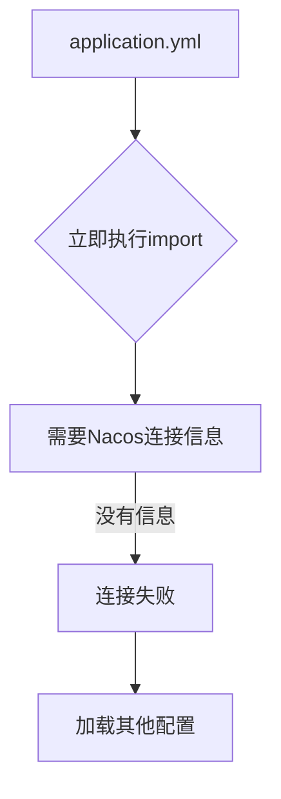

这是一个很好的问题！在 Spring Boot 3.x 中，**Nacos 注册/配置信息不能放在 `application-dev.yml`中**，原因如下：

## 原因分析

### 1. **配置加载顺序问题**

在 Spring Boot 3.x 中：

```
启动 → 执行 spring.config.import → 连接 Nacos → 加载其他配置
```

当 Spring Boot 看到：

```
# application.yml
spring:
  config:
    import: optional:nacos:aioveu-lss.yaml
```

它会**立即**需要知道：

- Nacos 服务器地址
- 命名空间
- 分组
- 认证信息

而这些信息**必须在 `spring.config.import`执行时已经可用**。

### 2. **`application-dev.yml`的加载时机**

`application-dev.yml`是在**配置文件合并阶段**加载的，但 `spring.config.import`是**立即执行的**。

```
1. 加载 application.yml
2. 立即执行 spring.config.import
3. 然后加载 application-dev.yml
4. 但此时 Nacos 连接已经失败了
```

### 3. **Spring Boot 3.x 的设计变化**

**2.x 的设计**：




**3.x 的设计**：




## 解决方案

### 方案1：Nacos 连接信息必须在主配置中

```
# application.yml
spring:
  application:
    name: aioveu-lss
  profiles:
    active: dev
  
  # Nacos 连接信息（必须在主配置）
  cloud:
    nacos:
      config:
        server-addr: localhost:8848
        namespace: ${nacos.namespace.current}
        group: DEFAULT_GROUP
        import-check:
          enabled: false
  
  # 动态计算命名空间
  nacos:
    namespace:
      mapping:
        dev: public
        prod: prod-namespace-id
      current: ${nacos.namespace.mapping.${spring.profiles.active}}
  
  # 配置导入
  config:
    import: optional:nacos:${spring.application.name}.yaml?namespace=${nacos.namespace.current}&group=DEFAULT_GROUP
```

### 方案2：环境特有的配置放在 dev 文件

```
# application-dev.yml
server:
  port: 9999

spring:
  mail:
    host: smtp.qq.com
    port: 587
    username: ambitiouschild@qq.com
    password: pwjbkmmfmuspdgjh
  
  # 其他环境特有配置
  # 但 Nacos 连接信息不能放这里
```

### 方案3：通过系统属性传递

```
# 启动时指定
java -jar app.jar \
  --spring.cloud.nacos.config.server-addr=localhost:8848 \
  --spring.cloud.nacos.config.namespace=public \
  --spring.profiles.active=dev
```

## 验证测试

创建测试代码查看配置加载顺序：

```
@Component
@Slf4j
public class ConfigLoadOrderTest implements ApplicationRunner {
    
    @Override
    public void run(ApplicationArguments args) throws Exception {
        // 获取所有配置源
        ConfigurableEnvironment env = (ConfigurableEnvironment) applicationContext.getEnvironment();
        
        log.info("=== 配置源加载顺序 ===");
        for (PropertySource<?> source : env.getPropertySources()) {
            log.info("配置源: {}", source.getName());
        }
        
        // 查看 Nacos 配置何时可用
        String nacosAddr = env.getProperty("spring.cloud.nacos.config.server-addr");
        String configImport = env.getProperty("spring.config.import");
        
        log.info("Nacos地址配置时间: {}", nacosAddr != null ? "启动时已有" : "启动后才有");
        log.info("配置导入设置: {}", configImport);
    }
    
    @Autowired
    private ApplicationContext applicationContext;
}
```

## 实际例子

**正确做法**：

```
# application.yml
spring:
  application:
    name: aioveu-lss
  
  cloud:
    nacos:
      config:
        server-addr: localhost:8848
        namespace: ${spring.profiles.active == 'dev' ? 'public' : 'prod-namespace'}
  
  config:
    import: optional:nacos:${spring.application.name}.yaml
```

**错误做法**：

```
# application-dev.yml
spring:
  cloud:
    nacos:
      config:
        server-addr: localhost:8848  # ❌ 太晚了！
```

## 总结

**为什么 Nacos 配置不能放 dev 文件**：

1. **时机不对**：`spring.config.import`执行时，dev 文件还没加载
2. **依赖关系**：Nacos 连接是配置加载的前提，不是结果
3. **Spring Boot 3.x 设计**：声明式配置，不是顺序加载

**必须放在主配置中**的配置：

- `spring.cloud.nacos.config.server-addr`
- `spring.cloud.nacos.config.namespace`
- `spring.cloud.nacos.config.group`
- `spring.config.import`

**可以放 dev 文件**的配置：

- 服务器端口
- 邮件配置
- 数据库连接（如果从 Nacos 获取）
- 其他业务配置