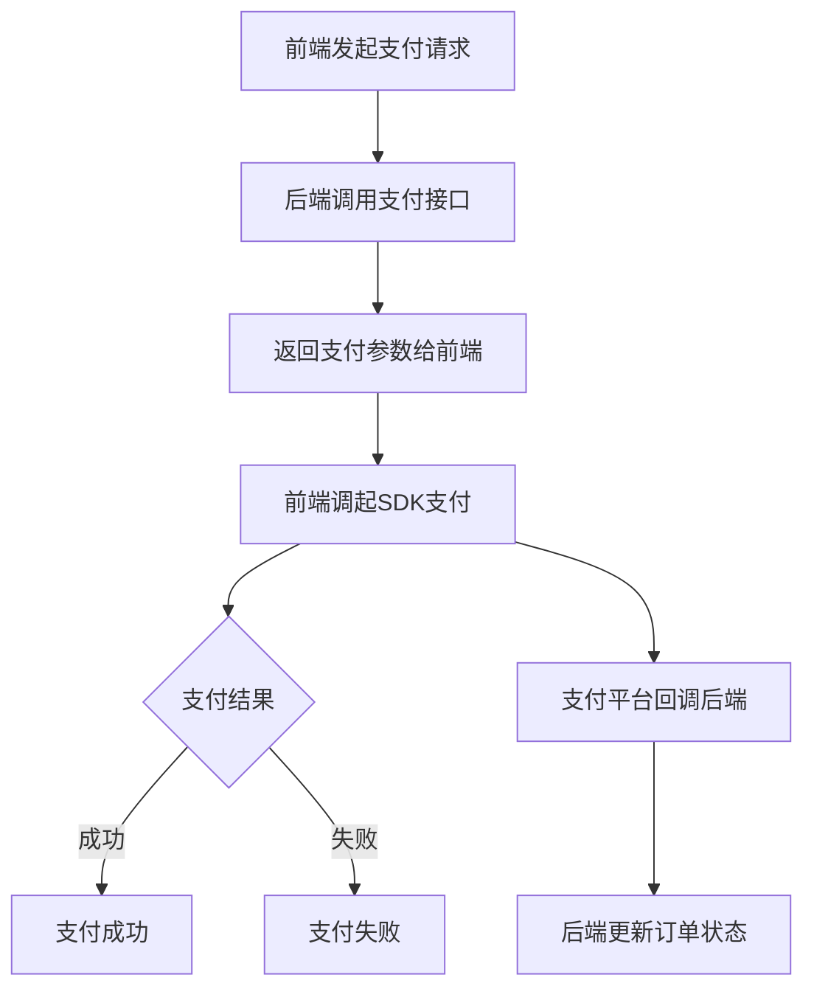

在 **APP支付** 场景下，应该返回 **支付参数** 而不是支付结果

## 🎯 APP支付流程分析

1. **创建支付** → 返回 **支付参数** (`PaymentParamsVO`)
2. **调起支付** → 前端使用参数调起支付宝/微信
3. **支付结果** → 通过回调通知后端

## 🔧 总结

**正确理解**：

1. ✅ **APP支付接口** → 返回 **支付参数** (`PaymentParamsVO`)，前端用这些参数调起支付
2. ✅ **支付结果** → 通过**回调接口**通知后端
3. ✅ **查询接口** → 返回**支付状态** (`PaymentStatusVO`)

**支付宝APP支付流程**：

1. 创建订单 → 获取支付参数
2. 前端用参数调起支付宝
3. 支付宝返回支付结果
4. 支付宝回调通知后端支付结果
5. 后端查询支付状态确认

这样设计符合支付流程，不会混淆支付参数和支付结果！🎉


您问到了关键点！**是的，APP支付通常是在前端调起的**。让我详细解释一下这个流程：

## 🎯 APP支付流程

### 1. **完整支付流程**

```
前端 App
  ↓
后端（您的系统）
  ↓
第三方支付平台（微信/支付宝）
  ↓
银行/钱包
```

### 2. **具体步骤**




### 3. **前后端分工**

#### **后端责任**：

```
// 1. 生成支付订单
public PaymentParamsVO createPayment(PaymentRequestDTO request) {
    // 创建系统订单
    PaymentOrder order = createOrder(request);
    
    // 调用支付平台API获取支付参数
    PaymentParamsVO params = callPaymentPlatform(order);
    
    // 返回给前端
    return params;
}

// 2. 处理支付回调
@PostMapping("/callback/{channel}")
public String handleCallback(@PathVariable String channel, 
                           @RequestBody String notifyData) {
    // 验证签名
    boolean valid = verifySignature(channel, notifyData);
    
    if (valid) {
        // 更新订单状态
        updateOrderStatus(notifyData);
        
        // 返回成功响应给支付平台
        return "success";
    }
    return "fail";
}
```

#### **前端责任**：

```
// 1. 调用后端创建支付
async function createPayment(orderNo, amount) {
    const response = await axios.post('/api/pay/create', {
        orderNo: orderNo,
        amount: amount,
        channel: 'alipay'
    });
    
    // 获取支付参数
    const paymentParams = response.data;
    
    // 2. 调起支付SDK
    if (paymentParams.channel === 'alipay') {
        // 调起支付宝
        window.AlipayJSBridge.call("tradePay", {
            orderStr: paymentParams.orderInfo
        }, function(result) {
            // 3. 处理支付结果
            handlePaymentResult(result);
        });
    } else if (paymentParams.channel === 'wechat') {
        // 调起微信支付
        WeixinJSBridge.invoke('getBrandWCPayRequest', {
            "appId": paymentParams.appId,
            "timeStamp": paymentParams.timeStamp,
            "nonceStr": paymentParams.nonceStr,
            "package": paymentParams.packageValue,
            "signType": paymentParams.signType,
            "paySign": paymentParams.paySign
        }, function(res) {
            handlePaymentResult(res);
        });
    }
}
```

## 📁 完整实现示例

### 后端 Controller

```
@RestController
@RequestMapping("/api/pay")
@RequiredArgsConstructor
public class PaymentController {
    
    private final PaymentService paymentService;
    
    /**
     * 创建支付订单
     */
    @PostMapping("/create")
    public Result<PaymentParamsVO> createPayment(@RequestBody PaymentRequestDTO request) {
        // 1. 生成支付单号
        String paymentNo = generatePaymentNo(request.getChannel());
        
        // 2. 根据渠道选择支付策略
        PaymentStrategy strategy = getStrategy(request.getChannel());
        
        // 3. 调用支付策略
        PaymentParamsVO paymentParams = strategy.appPay(paymentNo, request);
        
        // 4. 保存订单
        savePaymentOrder(paymentNo, request, paymentParams);
        
        return Result.success("支付创建成功", paymentParams);
    }
    
    /**
     * 查询支付状态
     */
    @GetMapping("/status/{paymentNo}")
    public Result<PaymentStatusVO> queryStatus(@PathVariable String paymentNo) {
        PaymentStatusVO status = paymentService.queryStatus(paymentNo);
        return Result.success("查询成功", status);
    }
    
    /**
     * 支付宝回调
     */
    @PostMapping("/callback/alipay")
    public String alipayCallback(HttpServletRequest request) {
        try {
            Map<String, String> params = getParams(request);
            
            // 验证签名
            boolean signVerified = alipayService.verifySignature(params);
            
            if (!signVerified) {
                return "failure";
            }
            
            // 处理业务
            String tradeNo = params.get("trade_no");
            String outTradeNo = params.get("out_trade_no");
            String tradeStatus = params.get("trade_status");
            
            if ("TRADE_SUCCESS".equals(tradeStatus) || 
                "TRADE_FINISHED".equals(tradeStatus)) {
                // 支付成功
                paymentService.handlePaymentSuccess(outTradeNo, tradeNo, params);
            }
            
            return "success";
        } catch (Exception e) {
            log.error("支付宝回调处理异常", e);
            return "failure";
        }
    }
    
    /**
     * 微信回调
     */
    @PostMapping("/callback/wechat")
    public String wechatCallback(@RequestBody String xmlData) {
        try {
            // 解析XML
            Map<String, String> data = parseXml(xmlData);
            
            // 验证签名
            boolean signVerified = wechatPayService.verifySignature(data);
            
            if (!signVerified) {
                return "<xml><return_code><![CDATA[FAIL]]></return_code></xml>";
            }
            
            // 处理业务
            String returnCode = data.get("return_code");
            String resultCode = data.get("result_code");
            
            if ("SUCCESS".equals(returnCode) && "SUCCESS".equals(resultCode)) {
                String outTradeNo = data.get("out_trade_no");
                String transactionId = data.get("transaction_id");
                
                paymentService.handlePaymentSuccess(outTradeNo, transactionId, data);
            }
            
            return "<xml><return_code><![CDATA[SUCCESS]]></return_code></xml>";
        } catch (Exception e) {
            log.error("微信回调处理异常", e);
            return "<xml><return_code><![CDATA[FAIL]]></return_code></xml>";
        }
    }
}
```

### 前端调用示例

#### React Native

```
// 支付宝支付
async function alipay(amount, orderNo) {
  try {
    // 1. 请求后端创建支付
    const response = await api.post('/api/pay/create', {
      orderNo,
      amount,
      channel: 'alipay',
      subject: '商品购买',
      body: '商品描述'
    });
    
    const { orderInfo } = response.data;
    
    // 2. 调起支付宝SDK
    const result = await Alipay.tradePay(orderInfo);
    
    // 3. 处理结果
    if (result.resultCode === '9000') {
      // 支付成功
      Toast.show('支付成功');
      // 跳转到成功页面
      navigation.navigate('PaymentSuccess');
    } else {
      // 支付失败
      Toast.show('支付失败: ' + result.memo);
    }
  } catch (error) {
    console.error('支付宝支付错误:', error);
  }
}

// 微信支付
async function wechatPay(amount, orderNo) {
  try {
    // 1. 请求后端创建支付
    const response = await api.post('/api/pay/create', {
      orderNo,
      amount,
      channel: 'wechat',
      subject: '商品购买'
    });
    
    const params = response.data;
    
    // 2. 调起微信SDK
    const result = await WeChat.pay({
      appId: params.appId,
      partnerId: params.partnerId,
      prepayId: params.prepayId,
      nonceStr: params.nonceStr,
      timeStamp: params.timeStamp,
      package: params.packageValue,
      sign: params.sign
    });
    
    // 3. 处理结果
    if (result === 0) {
      // 支付成功
      Toast.show('支付成功');
    } else {
      // 支付失败
      const msg = {
        '-1': '支付错误',
        '-2': '用户取消',
        '-3': '发送失败',
        '-4': '授权失败',
        '-5': '不支持'
      }[result] || '支付失败';
      Toast.show(msg);
    }
  } catch (error) {
    console.error('微信支付错误:', error);
  }
}
```

## 🎯 总结

**关键点**：

1. ✅ **后端**：生成支付订单，返回**支付参数**给前端
2. ✅ **前端**：使用SDK调起支付，处理**支付结果**
3. ✅ **支付平台**：处理实际的支付交易
4. ✅ **回调**：支付平台**异步通知**后端支付结果
5. ✅ **查询**：前端可以**主动查询**支付状态

**所以您的理解是正确的**：

- APP支付是在前端完成的
- 后端负责生成支付参数
- 前端负责调起支付SDK
- 支付结果通过回调通知后端

这样设计的好处是：

- 安全性：敏感支付信息在后端处理
- 灵活性：前后端解耦
- 可维护性：支付逻辑集中管理
- 扩展性：易于增加新的支付渠道