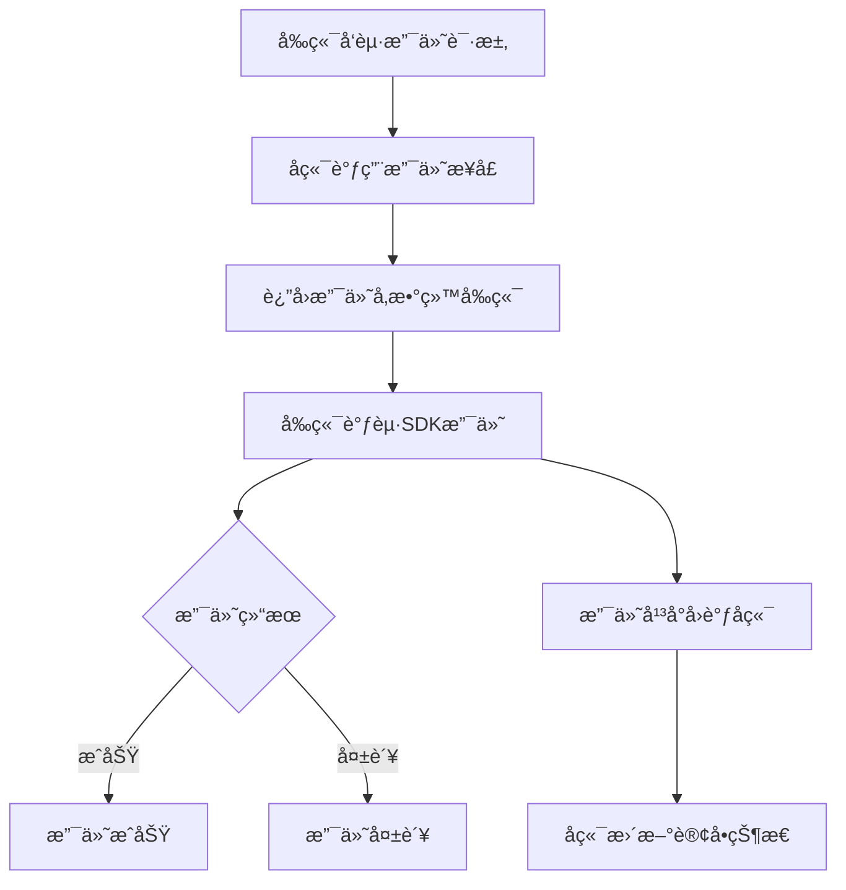

在 **APP支付** åœºæ™¯ä¸‹ï¼Œåº”è¯¥è¿”å› **支付å‚æ•°** 而ä¸æ˜¯æ”¯ä»˜ç»“æœ

## 🯠APP支付æµç¨‹åˆ†æ

1. **创建支付** → è¿”å› **支付å‚æ•°** (`PaymentParamsVO`)
2. **调起支付** → å‰ç«¯ä½¿ç”¨å‚数调起支付å®/微信
3. **支付结æœ** → 通过å›è°ƒé€šçŸ¥å端

## 🔧 总结

**正确ç†è§£**：

1. ✅ **APP支付æ¥å£** → è¿”å› **支付å‚æ•°** (`PaymentParamsVO`)，å‰ç«¯ç”¨è¿™äº›å‚数调起支付
2. ✅ **支付结æœ** → 通过**å›è°ƒæ¥å£**通知å端
3. ✅ **查询æ¥å£** → è¿”å›**支付状æ€** (`PaymentStatusVO`)

**支付å®APP支付æµç¨‹**：

1. åˆ›å»ºè®¢å• â†’ è·å–支付å‚æ•°
2. å‰ç«¯ç”¨å‚数调起支付å®
3. 支付å®è¿”å›æ”¯ä»˜ç»“æœ
4. 支付å®å›è°ƒé€šçŸ¥å端支付结æœ
5. å端查询支付状æ€ç¡®è®¤

这样设计符åˆæ”¯ä»˜æµç¨‹ï¼Œä¸ä¼šæ··æ·†æ”¯ä»˜å‚数和支付结æœï¼ğŸ‰


您问到了关键点ï¼**是的，APP支付通常是在å‰ç«¯è°ƒèµ·çš„**。让我详细解释一下这个æµç¨‹ï¼š

## 🯠APP支付æµç¨‹

### 1. **完整支付æµç¨‹**

```
å‰ç«¯ App
  ↓
å端（您的系统）
  ↓
第三方支付平å°ï¼ˆå¾®ä¿¡/支付å®ï¼‰
  ↓
银行/钱包
```

### 2. **具体步骤**




### 3. **å‰å端分工**

#### **å端责任**：

```
// 1. 生æˆæ”¯ä»˜è®¢å•
public PaymentParamsVO createPayment(PaymentRequestDTO request) {
    // 创建系统订å•
    PaymentOrder order = createOrder(request);
    
    // 调用支付平å°APIè·å–支付å‚æ•°
    PaymentParamsVO params = callPaymentPlatform(order);
    
    // è¿”å›ç»™å‰ç«¯
    return params;
}

// 2. 处ç†æ”¯ä»˜å›è°ƒ
@PostMapping("/callback/{channel}")
public String handleCallback(@PathVariable String channel, 
                           @RequestBody String notifyData) {
    // 验è¯ç­¾å
    boolean valid = verifySignature(channel, notifyData);
    
    if (valid) {
        // 更新订å•çŠ¶æ€
        updateOrderStatus(notifyData);
        
        // è¿”å›æˆåŠŸå“应给支付平å°
        return "success";
    }
    return "fail";
}
```

#### **å‰ç«¯è´£ä»»**：

```
// 1. 调用å端创建支付
async function createPayment(orderNo, amount) {
    const response = await axios.post('/api/pay/create', {
        orderNo: orderNo,
        amount: amount,
        channel: 'alipay'
    });
    
    // è·å–支付å‚æ•°
    const paymentParams = response.data;
    
    // 2. 调起支付SDK
    if (paymentParams.channel === 'alipay') {
        // 调起支付å®
        window.AlipayJSBridge.call("tradePay", {
            orderStr: paymentParams.orderInfo
        }, function(result) {
            // 3. 处ç†æ”¯ä»˜ç»“æœ
            handlePaymentResult(result);
        });
    } else if (paymentParams.channel === 'wechat') {
        // 调起微信支付
        WeixinJSBridge.invoke('getBrandWCPayRequest', {
            "appId": paymentParams.appId,
            "timeStamp": paymentParams.timeStamp,
            "nonceStr": paymentParams.nonceStr,
            "package": paymentParams.packageValue,
            "signType": paymentParams.signType,
            "paySign": paymentParams.paySign
        }, function(res) {
            handlePaymentResult(res);
        });
    }
}
```

## 📠完整å®ç°ç¤ºä¾‹

### å端 Controller

```
@RestController
@RequestMapping("/api/pay")
@RequiredArgsConstructor
public class PaymentController {
    
    private final PaymentService paymentService;
    
    /**
     * 创建支付订å•
     */
    @PostMapping("/create")
    public Result<PaymentParamsVO> createPayment(@RequestBody PaymentRequestDTO request) {
        // 1. 生æˆæ”¯ä»˜å•å·
        String paymentNo = generatePaymentNo(request.getChannel());
        
        // 2. æ ¹æ®æ¸ é“选择支付策略
        PaymentStrategy strategy = getStrategy(request.getChannel());
        
        // 3. 调用支付策略
        PaymentParamsVO paymentParams = strategy.appPay(paymentNo, request);
        
        // 4. ä¿å­˜è®¢å•
        savePaymentOrder(paymentNo, request, paymentParams);
        
        return Result.success("支付创建æˆåŠŸ", paymentParams);
    }
    
    /**
     * 查询支付状æ€
     */
    @GetMapping("/status/{paymentNo}")
    public Result<PaymentStatusVO> queryStatus(@PathVariable String paymentNo) {
        PaymentStatusVO status = paymentService.queryStatus(paymentNo);
        return Result.success("查询æˆåŠŸ", status);
    }
    
    /**
     * 支付å®å›è°ƒ
     */
    @PostMapping("/callback/alipay")
    public String alipayCallback(HttpServletRequest request) {
        try {
            Map<String, String> params = getParams(request);
            
            // 验è¯ç­¾å
            boolean signVerified = alipayService.verifySignature(params);
            
            if (!signVerified) {
                return "failure";
            }
            
            // 处ç†ä¸šåŠ¡
            String tradeNo = params.get("trade_no");
            String outTradeNo = params.get("out_trade_no");
            String tradeStatus = params.get("trade_status");
            
            if ("TRADE_SUCCESS".equals(tradeStatus) || 
                "TRADE_FINISHED".equals(tradeStatus)) {
                // 支付æˆåŠŸ
                paymentService.handlePaymentSuccess(outTradeNo, tradeNo, params);
            }
            
            return "success";
        } catch (Exception e) {
            log.error("支付å®å›è°ƒå¤„ç†å¼‚常", e);
            return "failure";
        }
    }
    
    /**
     * 微信å›è°ƒ
     */
    @PostMapping("/callback/wechat")
    public String wechatCallback(@RequestBody String xmlData) {
        try {
            // 解æXML
            Map<String, String> data = parseXml(xmlData);
            
            // 验è¯ç­¾å
            boolean signVerified = wechatPayService.verifySignature(data);
            
            if (!signVerified) {
                return "<xml><return_code><![CDATA[FAIL]]></return_code></xml>";
            }
            
            // 处ç†ä¸šåŠ¡
            String returnCode = data.get("return_code");
            String resultCode = data.get("result_code");
            
            if ("SUCCESS".equals(returnCode) && "SUCCESS".equals(resultCode)) {
                String outTradeNo = data.get("out_trade_no");
                String transactionId = data.get("transaction_id");
                
                paymentService.handlePaymentSuccess(outTradeNo, transactionId, data);
            }
            
            return "<xml><return_code><![CDATA[SUCCESS]]></return_code></xml>";
        } catch (Exception e) {
            log.error("微信å›è°ƒå¤„ç†å¼‚常", e);
            return "<xml><return_code><![CDATA[FAIL]]></return_code></xml>";
        }
    }
}
```

### å‰ç«¯è°ƒç”¨ç¤ºä¾‹

#### React Native

```
// 支付å®æ”¯ä»˜
async function alipay(amount, orderNo) {
  try {
    // 1. 请求å端创建支付
    const response = await api.post('/api/pay/create', {
      orderNo,
      amount,
      channel: 'alipay',
      subject: '商å“è´­ä¹°',
      body: '商å“æè¿°'
    });
    
    const { orderInfo } = response.data;
    
    // 2. 调起支付å®SDK
    const result = await Alipay.tradePay(orderInfo);
    
    // 3. 处ç†ç»“æœ
    if (result.resultCode === '9000') {
      // 支付æˆåŠŸ
      Toast.show('支付æˆåŠŸ');
      // 跳转到æˆåŠŸé¡µé¢
      navigation.navigate('PaymentSuccess');
    } else {
      // 支付失败
      Toast.show('支付失败: ' + result.memo);
    }
  } catch (error) {
    console.error('支付å®æ”¯ä»˜é”™è¯¯:', error);
  }
}

// 微信支付
async function wechatPay(amount, orderNo) {
  try {
    // 1. 请求å端创建支付
    const response = await api.post('/api/pay/create', {
      orderNo,
      amount,
      channel: 'wechat',
      subject: '商å“è´­ä¹°'
    });
    
    const params = response.data;
    
    // 2. 调起微信SDK
    const result = await WeChat.pay({
      appId: params.appId,
      partnerId: params.partnerId,
      prepayId: params.prepayId,
      nonceStr: params.nonceStr,
      timeStamp: params.timeStamp,
      package: params.packageValue,
      sign: params.sign
    });
    
    // 3. 处ç†ç»“æœ
    if (result === 0) {
      // 支付æˆåŠŸ
      Toast.show('支付æˆåŠŸ');
    } else {
      // 支付失败
      const msg = {
        '-1': '支付错误',
        '-2': '用户å–消',
        '-3': 'å‘é€å¤±è´¥',
        '-4': 'æˆæƒå¤±è´¥',
        '-5': 'ä¸æ”¯æŒ'
      }[result] || '支付失败';
      Toast.show(msg);
    }
  } catch (error) {
    console.error('微信支付错误:', error);
  }
}
```

## 🯠总结

**关键点**：

1. ✅ **å端**：生æˆæ”¯ä»˜è®¢å•ï¼Œè¿”å›**支付å‚æ•°**ç»™å‰ç«¯
2. ✅ **å‰ç«¯**：使用SDK调起支付，处ç†**支付结æœ**
3. ✅ **支付平å°**：处ç†å®é™…的支付交易
4. ✅ **å›è°ƒ**：支付平å°**异步通知**å端支付结æœ
5. ✅ **查询**：å‰ç«¯å¯ä»¥**主动查询**支付状æ€

**所以您的ç†è§£æ˜¯æ­£ç¡®çš„**：

- APP支付是在å‰ç«¯å®Œæˆçš„
- å端负责生æˆæ”¯ä»˜å‚æ•°
- å‰ç«¯è´Ÿè´£è°ƒèµ·æ”¯ä»˜SDK
- 支付结æœé€šè¿‡å›è°ƒé€šçŸ¥å端

这样设计的好处是：

- 安全性：æ•æ„Ÿæ”¯ä»˜ä¿¡æ¯åœ¨å端处ç†
- çµæ´»æ€§ï¼šå‰å端解耦
- å¯ç»´æŠ¤æ€§ï¼šæ”¯ä»˜é€»è¾‘集中管ç†
- 扩展性：易äºå¢åŠ æ–°çš„支付渠é“