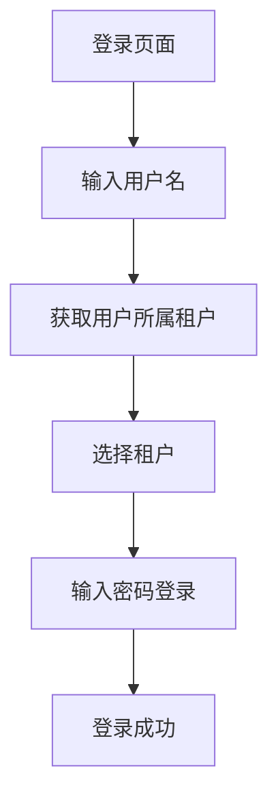

**是的，你说得很对！用户名包含租户的方式很麻烦，不推荐使用。**

## **为什么不推荐用户名包含租户**

1. **用户体验差**：用户需要记住复杂的用户名格式
2. **维护困难**：同一个用户在不同租户下需要不同的用户名
3. **容易出错**：格式错误导致登录失败
4. **安全性问题**：暴露租户标识
5. **扩展性差**：不支持一个用户属于多个租户

## **推荐方案：登录前选择租户**

### **方案1：两步登录流程（最推荐）**



**实现步骤**：

#### **第一步：输入用户名，获取租户列表**

```
<template>
  <!-- 第一步：输入用户名 -->
  <div v-if="step === 1">
    <el-form-item>
      <el-input
        v-model="username"
        placeholder="请输入用户名"
        :prefix-icon="User"
        @keyup.enter="getTenants"
      />
    </el-form-item>
    <el-button type="primary" :loading="loading" @click="getTenants">
      下一步
    </el-button>
  </div>
  
  <!-- 第二步：选择租户并输入密码 -->
  <div v-if="step === 2">
    <el-form-item>
      <el-select
        v-model="form.tenantId"
        placeholder="请选择租户"
        :loading="tenantLoading"
      >
        <el-option
          v-for="tenant in tenantList"
          :key="tenant.id"
          :label="`${tenant.name} (${tenant.code})`"
          :value="tenant.id"
        />
      </el-select>
    </el-form-item>
    
    <el-form-item>
      <el-input
        v-model="form.password"
        type="password"
        placeholder="请输入密码"
        :prefix-icon="Lock"
        @keyup.enter="handleLogin"
      />
    </el-form-item>
    
    <el-button @click="step = 1">上一步</el-button>
    <el-button type="primary" :loading="loading" @click="handleLogin">
      登录
    </el-button>
  </div>
</template>

<script setup lang="ts">
import { ref, reactive } from "vue";
import { User, Lock } from "@element-plus/icons-vue";
import { getTenantsByUsername, login } from "@/api/auth";

const step = ref(1);
const username = ref("");
const tenantList = ref<any[]>([]);
const loading = ref(false);
const tenantLoading = ref(false);

const form = reactive({
  tenantId: undefined as number | undefined,
  password: "",
});

// 获取用户所属租户
const getTenants = async () => {
  if (!username.value) {
    ElMessage.warning("请输入用户名");
    return;
  }
  
  tenantLoading.value = true;
  try {
    const res = await getTenantsByUsername(username.value);
    tenantList.value = res.data || [];
    
    if (tenantList.value.length === 0) {
      ElMessage.warning("该用户不属于任何租户");
      return;
    }
    
    if (tenantList.value.length === 1) {
      // 只有一个租户，自动选择
      form.tenantId = tenantList.value[0].id;
    }
    
    step.value = 2;
  } catch (error) {
    console.error("获取租户失败:", error);
  } finally {
    tenantLoading.value = false;
  }
};

// 登录
const handleLogin = async () => {
  if (!form.tenantId) {
    ElMessage.warning("请选择租户");
    return;
  }
  
  if (!form.password) {
    ElMessage.warning("请输入密码");
    return;
  }
  
  loading.value = true;
  try {
    const res = await login({
      username: username.value,
      password: form.password,
      tenantId: form.tenantId,
    });
    
    if (res.code === 200) {
      ElMessage.success("登录成功");
      // 处理登录成功
    }
  } catch (error) {
    console.error("登录失败:", error);
  } finally {
    loading.value = false;
  }
};
</script>
```

#### **后端接口**

```
// 1. 根据用户名获取租户列表
@GetMapping("/auth/tenants")
public Result<List<TenantVO>> getTenantsByUsername(@RequestParam String username) {
    // 先验证用户是否存在（不验证密码）
    User user = userService.getUserByUsername(username);
    if (user == null) {
        return Result.failed("用户不存在");
    }
    
    // 查询用户所属的租户
    List<TenantVO> tenants = tenantService.getTenantsByUserId(user.getId());
    
    return Result.success(tenants);
}

// 2. 登录接口
@PostMapping("/auth/login")
public Result<LoginResult> login(@RequestBody @Valid LoginForm form) {
    // 验证租户状态
    Tenant tenant = tenantService.getById(form.getTenantId());
    if (tenant == null || tenant.getStatus() != 1) {
        return Result.failed("租户不存在或已禁用");
    }
    
    // 验证用户是否属于该租户
    boolean hasPermission = userService.checkUserTenantPermission(
        form.getUsername(), form.getTenantId());
    if (!hasPermission) {
        return Result.failed("用户无权访问此租户");
    }
    
    // 设置租户上下文
    TenantContext.setCurrentTenantId(form.getTenantId());
    
    // 验证用户名密码
    Authentication authentication = authenticationManager.authenticate(
        new UsernamePasswordAuthenticationToken(
            form.getUsername(),
            form.getPassword()
        )
    );
    
    // 生成token
    LoginUser loginUser = (LoginUser) authentication.getPrincipal();
    String token = tokenService.createToken(loginUser);
    
    return Result.success(new LoginResult(token, form.getTenantId()));
}
```

### **方案2：租户选择 + 记住选择**

```
<template>
  <!-- 租户选择（独立组件） -->
  <tenant-selector
    v-model="selectedTenant"
    :username="form.username"
    @tenant-change="onTenantChange"
  />
  
  <!-- 登录表单 -->
  <el-form>
    <el-form-item>
      <el-input v-model="form.username" placeholder="用户名" />
    </el-form-item>
    
    <el-form-item>
      <el-input v-model="form.password" type="password" placeholder="密码" />
    </el-form-item>
    
    <el-button @click="handleLogin">登录</el-button>
  </el-form>
</template>

<script setup lang="ts">
import { ref, watch } from "vue";
import TenantSelector from "./TenantSelector.vue";

const selectedTenant = ref();

// 监听用户名变化，自动获取租户
watch(
  () => form.username,
  (newUsername) => {
    if (newUsername) {
      // 自动获取用户所属租户
      loadUserTenants(newUsername);
    }
  },
  { immediate: true }
);

// 租户变化
const onTenantChange = (tenant) => {
  form.tenantId = tenant?.id;
  // 保存到本地存储
  localStorage.setItem("lastTenant", JSON.stringify(tenant));
};
</script>
```

## **数据库设计支持**

### **用户-租户关联表**

```
CREATE TABLE sys_user_tenant (
    id BIGINT PRIMARY KEY AUTO_INCREMENT,
    user_id BIGINT NOT NULL COMMENT '用户ID',
    tenant_id BIGINT NOT NULL COMMENT '租户ID',
    is_default TINYINT DEFAULT 0 COMMENT '是否默认租户',
    status TINYINT DEFAULT 1 COMMENT '状态：1-正常 0-禁用',
    create_time DATETIME DEFAULT CURRENT_TIMESTAMP,
    update_time DATETIME DEFAULT CURRENT_TIMESTAMP ON UPDATE CURRENT_TIMESTAMP,
    UNIQUE KEY uk_user_tenant (user_id, tenant_id),
    INDEX idx_tenant (tenant_id),
    INDEX idx_user (user_id)
) COMMENT='用户租户关联表';
```

### **查询用户所属租户**

```
@Service
public class UserServiceImpl implements UserService {
    
    public List<TenantVO> getTenantsByUserId(Long userId) {
        return userTenantMapper.selectTenantsByUserId(userId);
    }
    
    public boolean checkUserTenantPermission(Long userId, Long tenantId) {
        return userTenantMapper.existsByUserAndTenant(userId, tenantId) > 0;
    }
}
```

## **最佳实践建议**

### **1. 用户体验优化**

```
<!-- 租户选择卡片式 -->
<div class="tenant-grid">
  <div
    v-for="tenant in tenantList"
    :key="tenant.id"
    class="tenant-card"
    :class="{ active: selectedTenantId === tenant.id }"
    @click="selectTenant(tenant)"
  >
    <div class="tenant-logo">
      
    </div>
    <div class="tenant-info">
      <h4>{{ tenant.name }}</h4>
      <p>{{ tenant.description }}</p>
    </div>
  </div>
</div>
```

### **2. 记住上次选择**

```
// 自动记住上次选择的租户
const loadLastSelectedTenant = () => {
  const lastTenant = localStorage.getItem("lastTenant");
  if (lastTenant) {
    const tenant = JSON.parse(lastTenant);
    form.tenantId = tenant.id;
    selectedTenant.value = tenant;
  }
};
```

### **3. 管理员可以切换租户**

```
// 如果是管理员，可以切换到任何租户
if (user.isAdmin) {
  // 显示所有租户选项
  tenantList.value = await getAllTenants();
} else {
  // 只显示用户所属租户
  tenantList.value = await getUserTenants(user.id);
}
```

## **总结**

**推荐使用两步登录流程**：

1. **第一步**：输入用户名 → 获取用户所属租户列表
2. **第二步**：选择租户 + 输入密码 → 登录

**优点**：

- ✅ 用户体验好
- ✅ 支持一个用户多个租户
- ✅ 安全可靠
- ✅ 扩展性强
- ✅ 便于管理

**实现要点**：

1. 添加用户-租户关联表
2. 修改登录接口支持租户选择
3. 前端实现两步登录流程
4. 记住用户选择偏好