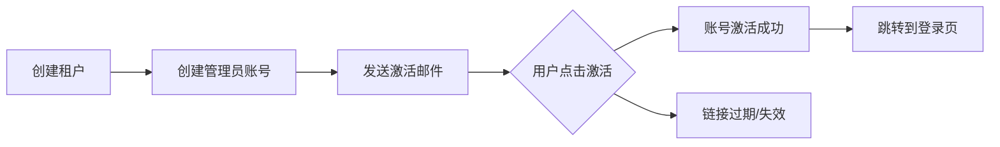

多租户系统的账号创建流程有不同的模式，这取决于你的**租户隔离级别**和**业务需求**。下面是常见的几种流程：

## 📊 多租户账号创建流程对比

### 模式A：先租户 → 后用户（当前你的流程）


**适用场景**：

- SaaS平台，租户由平台方创建和管理
- 租户数量有限，由平台集中管控
- 企业级应用，需要严格的审批流程

### 模式B：租户自注册 → 自管理

**适用场景**：

- 公有云SaaS，租户可自助注册
- 需要快速扩展用户规模
- 减少平台方运营成本

### 模式C：混合模式

## 🔧 详细步骤拆解

### 你的当前流程（平台驱动）

```
// 1. 平台管理员创建租户
TenantVO tenant = new TenantVO();
tenant.setName("XX公司");
tenant.setCode("TENANT_001");
tenant.setStatus(1);
tenantService.createTenant(tenant);

// 2. 为租户创建初始用户（通常是管理员）
UserVO adminUser = new UserVO();
adminUser.setUsername("admin@tenant.com");
adminUser.setTenantId(tenant.getId());
adminUser.setIsTenantAdmin(true);
userService.createUser(adminUser);

// 3. 为管理员分配角色
RoleVO adminRole = roleService.getRoleByCode("TENANT_ADMIN");
userRoleService.assignRole(adminUser.getId(), adminRole.getId());

// 4. 发送账号激活通知（邮件/短信）
notificationService.sendAccountActivation(adminUser);
```

### 更优的流程设计

#### 方案1：租户注册流程

```
@PostMapping("/tenant/register")
public ApiResult registerTenant(@RequestBody TenantRegisterDTO dto) {
    // 1. 验证注册信息
    validateRegisterInfo(dto);
    
    // 2. 创建租户（状态为待激活）
    TenantVO tenant = tenantService.createTenantWithPending(dto.getTenantInfo());
    
    // 3. 创建租户管理员账号
    UserVO adminUser = userService.createTenantAdmin(
        dto.getAdminUser(), 
        tenant.getId()
    );
    
    // 4. 自动分配租户管理员角色
    roleService.assignDefaultTenantRole(adminUser.getId(), tenant.getId());
    
    // 5. 发送激活邮件
    String activateToken = tokenService.generateActivateToken(adminUser.getId());
    emailService.sendTenantActivationEmail(
        adminUser.getEmail(),
        tenant.getName(),
        activateToken
    );
    
    return ApiResult.success("注册成功，请查收激活邮件");
}
```

#### 方案2：邀请制流程

```
@PostMapping("/tenant/{tenantId}/invite")
public ApiResult inviteUser(@PathVariable Long tenantId, 
                           @RequestBody UserInviteDTO inviteDTO) {
    // 1. 验证邀请权限
    checkInvitePermission(currentUserId, tenantId);
    
    // 2. 创建或查找用户
    UserVO user = userService.findOrCreateUser(inviteDTO.getEmail());
    
    // 3. 关联用户到租户
    userTenantService.addUserToTenant(user.getId(), tenantId);
    
    // 4. 分配角色
    if (!CollectionUtils.isEmpty(inviteDTO.getRoleCodes())) {
        roleService.assignRolesToUser(user.getId(), inviteDTO.getRoleCodes(), tenantId);
    }
    
    // 5. 发送邀请
    String inviteToken = tokenService.generateInviteToken(user.getId(), tenantId);
    notificationService.sendInvitation(
        user.getEmail(),
        inviteDTO.getInviterName(),
        tenantService.getTenantName(tenantId),
        inviteToken
    );
    
    return ApiResult.success("邀请已发送");
}
```

## 🎯 关键设计考虑

### 1. 账号模型选择

```
// 模型A：用户全局唯一，可跨租户
class User {
    Long id;
    String username;  // 全局唯一
    String email;     // 全局唯一
    List<UserTenant> tenants;  // 关联的租户
}

// 模型B：用户在租户内唯一
class User {
    Long id;
    String username;  // 在tenantId内唯一
    Long tenantId;    // 所属租户
    String email;     // 可重复
}
```

### 2. 角色权限设计

```
// 租户级别的角色
enum TenantRole {
    TENANT_ADMIN,     // 租户管理员：管理本租户所有资源
    TENANT_OPERATOR,  // 操作员：有部分管理权限
    TENANT_USER       // 普通用户：仅使用权限
}

// 数据权限控制
@DataPermission(tenantId = "#tenantId")
public List<UserVO> getUsersByTenant(Long tenantId) {
    // 自动注入tenantId过滤条件
    return userMapper.selectByTenantId(tenantId);
}
```

### 3. 激活流程设计



## 📋 推荐的最佳实践流程

### 步骤1：平台创建租户（简化版）

```
public TenantCreateResult createTenantWithAdmin(TenantCreateDTO dto) {
    // 1. 创建租户
    TenantVO tenant = tenantService.create(dto.getTenant());
    
    // 2. 创建管理员账号（初始密码随机）
    String initPassword = PasswordUtils.generateRandomPassword();
    UserVO admin = userService.createUser(
        UserCreateDTO.builder()
            .username(dto.getAdminEmail())
            .email(dto.getAdminEmail())
            .tenantId(tenant.getId())
            .password(initPassword)
            .realName(dto.getAdminName())
            .build()
    );
    
    // 3. 分配管理员角色
    roleService.assignRole(admin.getId(), "TENANT_ADMIN", tenant.getId());
    
    // 4. 发送欢迎邮件（包含登录信息）
    emailService.sendWelcomeEmail(
        admin.getEmail(),
        tenant.getName(),
        admin.getUsername(),
        initPassword,  // 或重置密码链接
        dto.getAdminName()
    );
    
    return TenantCreateResult.success(tenant, admin);
}
```

### 步骤2：租户管理员登录后操作

```
// 租户管理员可以：
// 1. 修改租户信息
// 2. 创建子账号
// 3. 定义角色和权限
// 4. 分配用户角色
// 5. 管理部门/组织架构
```

## ⚠️ 注意事项

1. **账号唯一性**：

   - 邮箱/手机号是否需要全局唯一？
   - 用户名在租户内唯一还是全局唯一？

2. **初始安全**：

   - 初始密码是随机生成还是由管理员设置？
   - 是否需要首次登录强制修改密码？

3. **数据隔离**：

   ```
   -- 所有查询都要带上tenant_id条件
   SELECT * FROM users WHERE tenant_id = #{tenantId} AND id = #{userId}
   ```

4. **审计日志**：

   - 记录谁在什么时候创建了租户/用户
   - 记录角色分配变更历史

## 🚀 改进建议

如果你当前是**平台集中管理**模式，可以考虑：

1. **增加自助服务**：允许租户管理员自己创建子用户
2. **批量导入**：支持Excel导入用户
3. **邀请机制**：现有用户邀请新用户加入
4. **同步外部系统**：从企业微信/钉钉同步组织架构
5. **审批流程**：重要操作需要审批

**你的选择应该基于**：

- 目标用户类型（企业/个人）
- 系统规模预期
- 运营成本考虑
- 安全合规要求

你当前的流程（平台→租户→用户→角色）是比较传统的企业级做法，如果用户规模不大，这是完全可行的。