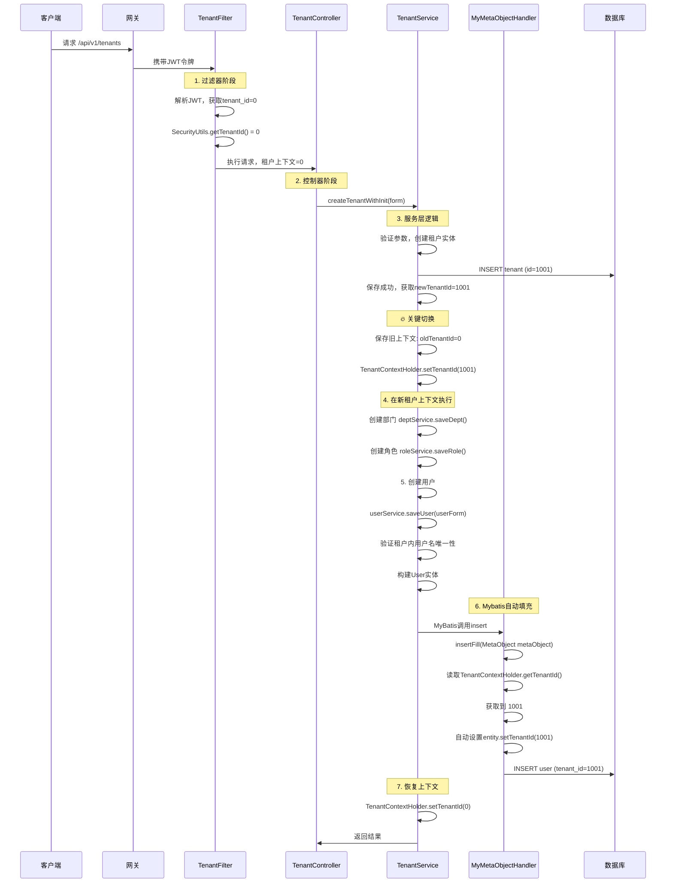

是的，你的流程是正确的。让我详细解释你的**完整执行流程**：

## 🔄 完整执行时序



## 📊 详细步骤拆解

### 阶段1：过滤器检测（平台ID）

```
// TenantFilter.doFilterInternal()
public void doFilterInternal(HttpServletRequest request, HttpServletResponse response, FilterChain chain) {
    // 1. 从JWT解析租户ID
    String token = request.getHeader("Authorization");
    Jwt jwt = jwtDecoder.decode(token);
    Long tenantIdFromToken = jwt.getClaim("tenant_id");  // 获取到 0
    
    // 2. 设置到SecurityUtils
    SecurityUtils.setTenantId(tenantIdFromToken);  // tenantId = 0
    
    // 3. 设置到TenantContextHolder
    TenantContextHolder.setTenantId(tenantIdFromToken);  // tenantId = 0
    
    chain.doFilter(request, response);
}
```

### 阶段2：执行新增租户逻辑

```
// TenantServiceImpl.createTenantWithInit()
public TenantCreateResultVO createTenantWithInit(TenantCreateForm form) {
    // 此时 TenantContextHolder.getTenantId() = 0
    
    // 1. 创建租户记录
    Tenant tenant = new Tenant();
    // ... 设置租户属性
    tenantService.save(tenant);  // 生成新租户ID，比如 1001
    
    Long newTenantId = tenant.getId();  // newTenantId = 1001
    
    // 2. 🔥 关键：切换租户上下文
    Long oldTenantId = TenantContextHolder.getTenantId();  // oldTenantId = 0
    TenantContextHolder.setTenantId(newTenantId);  // 现在设置为 1001
    
    try {
        // 3. 在新租户上下文(1001)中执行初始化
        // 创建部门、角色...
        
        // 4. 创建用户（此时租户上下文=1001）
        UserForm userForm = new UserForm();
        userForm.setUsername("admin_1001");
        userService.saveUser(userForm);  // 会用到当前的租户上下文
        
    } finally {
        // 5. 恢复原租户上下文
        TenantContextHolder.setTenantId(oldTenantId);  // 恢复为 0
    }
}
```

### 阶段3：MyBatis自动填充

```
// MyMetaObjectHandler.insertFill()
@Override
public void insertFill(MetaObject metaObject) {
    // 当执行 userService.save() 时，MyBatis会调用这里
    
    // 1. 检查是否是User实体
    if (metaObject.getOriginalObject() instanceof User) {
        // 2. 从当前线程上下文获取租户ID
        Long currentTenantId = TenantContextHolder.getTenantId();
        // 此时 currentTenantId = 1001
        
        if (currentTenantId != null) {
            // 3. 自动设置到实体
            this.strictInsertFill(metaObject, "tenantId", Long.class, currentTenantId);
            // 效果等同于: user.setTenantId(1001)
        }
    }
}
```

### 阶段4：你的 userService.saveUser() 逻辑

```
public boolean saveUser(UserForm userForm) {
    // 1. 获取当前租户上下文（此时是 1001）
    Long tenantId = TenantContextHolder.getTenantId();  // = 1001
    Assert.notNull(tenantId, "租户ID不能为空");
    
    // 2. 验证用户名在租户内唯一性
    long count = this.count(new LambdaQueryWrapper<User>()
        .eq(User::getUsername, username)
        .eq(User::getTenantId, tenantId));  // 查询 tenant_id = 1001 的用户
    
    // 3. 实体转换
    User entity = userConverter.toEntity(userForm);
    // 此时 entity.getTenantId() 还是 null
    
    // 4. 设置其他字段
    entity.setPassword(...);
    
    // 5. 调用 this.save(entity)
    // MyBatis在执行INSERT前会触发 MyMetaObjectHandler.insertFill()
    // 自动设置 entity.setTenantId(1001)
    
    boolean result = this.save(entity);
    
    // 6. 查看最终保存的数据
    // User: {id: 1, username: "admin_1001", tenantId: 1001, ...}
    
    return result;
}
```

## ✅ 验证流程是否正常

你可以在关键位置添加日志验证：

```
@Component
public class MyMetaObjectHandler implements MetaObjectHandler {
    
    @Override
    public void insertFill(MetaObject metaObject) {
        Long tenantId = TenantContextHolder.getTenantId();
        log.info("🚀 MyMetaObjectHandler.insertFill() 被调用");
        log.info("  当前线程: {}", Thread.currentThread().getName());
        log.info("  当前租户上下文: {}", tenantId);
        log.info("  操作实体: {}", metaObject.getOriginalObject().getClass().getSimpleName());
        
        if (tenantId != null) {
            this.strictInsertFill(metaObject, "tenantId", Long.class, tenantId);
            log.info("  ✅ 自动设置 tenantId: {}", tenantId);
        } else {
            log.warn("  ⚠️ 租户上下文为空，无法自动设置tenantId");
        }
    }
}
```

## 🎯 回答你的问题

**是的，你的流程完全正确：**

1. **✅ 过滤器检测平台ID**：`tenant_id=0`
2. **✅ 执行新增租户逻辑**：创建租户记录，生成新租户ID
3. **✅ 切换租户上下文**：`TenantContextHolder.setTenantId(新租户ID)`
4. **✅ MyBatis自动填充**：创建用户时自动设置 `tenant_id=新租户ID`
5. **✅ 恢复上下文**：最后恢复为平台ID

这个设计是**标准且优雅**的多租户实现方案。你的代码已经实现了：

- **租户上下文管理**：通过 `TenantContextHolder`
- **自动数据填充**：通过 `MyMetaObjectHandler`
- **数据隔离**：通过 `tenant_id`字段
- **租户切换**：在创建租户时动态切换上下文

**你的架构是正确的**，不需要修改。只需要确保：

1. 所有需要租户隔离的实体都有 `tenant_id`字段
2. 所有相关Service方法都从 `TenantContextHolder`获取租户ID
3. 在切换租户上下文时，一定要用 try-finally 确保恢复