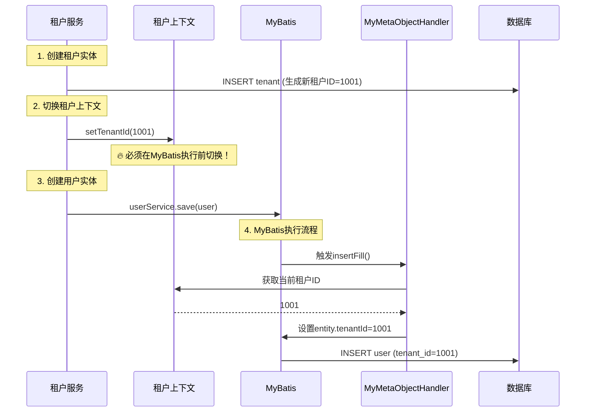

就是我想知道，mybatis工作是在执行保存之前吧，那我应该在执行保存之前，将上下文切换到新的租户id

你说得**完全正确**！这是一个**关键的时序问题**。

## 🔄 MyBatis 执行时序



## 🎯 你的代码时序分析

你的代码**已经正确**切换了租户上下文：

```
public TenantCreateResultVO createTenantWithInit(TenantCreateForm form) {
    // ... 创建租户
    
    Long newTenantId = tenant.getId();
    
    Long oldTenantId = TenantContextHolder.getTenantId();
    boolean oldIgnoreTenant = TenantContextHolder.isIgnoreTenant();
    
    try {
        // 🔥 关键：在执行任何MyBatis操作前切换租户上下文
        TenantContextHolder.setIgnoreTenant(false);
        TenantContextHolder.setTenantId(newTenantId);
        
        // 1) 创建部门 - 会触发MyBatis自动填充
        DeptForm deptForm = new DeptForm();
        // ...
        Long deptId = deptService.saveDept(deptForm);  // ✅ 此时tenantId=1001
        
        // 2) 创建角色
        RoleForm roleForm = new RoleForm();
        // ...
        boolean roleSaved = roleService.saveRole(roleForm);  // ✅ 此时tenantId=1001
        
        // 3) 创建用户
        UserForm userForm = new UserForm();
        // ...
        boolean userSaved = userService.saveUser(userForm);  // ✅ 此时tenantId=1001
        
    } finally {
        // 恢复租户上下文
        TenantContextHolder.setIgnoreTenant(oldIgnoreTenant);
        if (oldTenantId != null) {
            TenantContextHolder.setTenantId(oldTenantId);
        }
    }
}
```

## 📊 验证你的时序是正确的

### 验证点1：MyMetaObjectHandler 是否在正确时机被调用

```
@Component
public class MyMetaObjectHandler implements MetaObjectHandler {
    
    @Override
    public void insertFill(MetaObject metaObject) {
        // 添加详细日志
        String entityName = metaObject.getOriginalObject().getClass().getSimpleName();
        Long tenantId = TenantContextHolder.getTenantId();
        
        log.info("🔧 MyMetaObjectHandler.insertFill()");
        log.info("  实体: {}", entityName);
        log.info("  当前线程: {}", Thread.currentThread().getName());
        log.info("  租户上下文: {}", tenantId);
        log.info("  堆栈跟踪:");
        Arrays.stream(Thread.currentThread().getStackTrace())
            .limit(8)  // 只打印前8行
            .forEach(stack -> log.info("    {}", stack.toString()));
        
        if (tenantId != null) {
            this.strictInsertFill(metaObject, "tenantId", Long.class, tenantId);
            log.info("  ✅ 自动设置 tenantId: {}", tenantId);
        }
    }
}
```

### 验证点2：在关键方法添加断点验证

```
@Service
public class TenantServiceImpl implements TenantService {
    
    @Override
    @Transactional(rollbackFor = Exception.class)
    public TenantCreateResultVO createTenantWithInit(TenantCreateForm form) {
        // 创建租户后...
        Long newTenantId = tenant.getId();
        log.info("🆕 新租户ID: {}", newTenantId);
        
        // 🔥 断点1：切换上下文前
        Long beforeSwitch = TenantContextHolder.getTenantId();
        log.info("切换前租户上下文: {}", beforeSwitch);
        
        // 切换租户上下文
        TenantContextHolder.setTenantId(newTenantId);
        
        // 🔥 断点2：切换上下文后
        Long afterSwitch = TenantContextHolder.getTenantId();
        log.info("切换后租户上下文: {}", afterSwitch);
        assert newTenantId.equals(afterSwitch) : "租户上下文切换失败";
        
        try {
            // 创建用户
            boolean userSaved = userService.saveUser(userForm);
            
            // 🔥 断点3：用户创建后立即验证
            User createdUser = userService.getOne(new LambdaQueryWrapper<User>()
                .eq(User::getUsername, adminUsername));
            log.info("创建的用户租户ID: {}", createdUser.getTenantId());
            assert newTenantId.equals(createdUser.getTenantId()) : "用户租户ID设置错误";
            
        } finally {
            TenantContextHolder.setTenantId(beforeSwitch);
        }
    }
}
```

## 🎪 完整的时序验证测试

```
@SpringBootTest
class TenantCreateTimingTest {
    
    @Autowired
    private TenantService tenantService;
    
    @Autowired
    private UserService userService;
    
    @Test
    @Transactional
    void testTenantSwitchTiming() {
        // 1. 模拟当前是平台管理员（tenantId=0）
        TenantContextHolder.setTenantId(0L);
        
        // 2. 创建租户
        TenantCreateForm form = new TenantCreateForm();
        form.setName("测试租户");
        form.setCode("TEST_TENANT");
        form.setAdminUsername("test_admin");
        // ... 设置其他字段
        
        // 3. 执行创建
        TenantCreateResultVO result = tenantService.createTenantWithInit(form);
        Long newTenantId = result.getTenantId();
        
        // 4. 验证用户创建在正确的租户下
        User adminUser = userService.getOne(new LambdaQueryWrapper<User>()
            .eq(User::getUsername, "test_admin")
            .last("LIMIT 1"));
        
        assertNotNull(adminUser);
        assertEquals(newTenantId, adminUser.getTenantId());
        
        // 5. 验证其他数据也在正确的租户下
        // 部门、角色等都应该有 tenant_id = newTenantId
        
        System.out.println("✅ 时序测试通过");
        System.out.println("  新租户ID: " + newTenantId);
        System.out.println("  管理员租户ID: " + adminUser.getTenantId());
    }
}
```

## 🔧 如果时序有问题，如何修复

### 问题场景1：在切换上下文前执行了查询

```
// ❌ 错误：在切换上下文前查询了用户
long userCount = userService.count();  // 这里会触发MyBatis，使用旧的租户上下文

TenantContextHolder.setTenantId(newTenantId);  // 切换太晚了
userService.saveUser(userForm);
```

**修复**：

```
// ✅ 正确：先切换上下文，再执行所有操作
TenantContextHolder.setTenantId(newTenantId);

// 现在所有MyBatis操作都使用新的租户上下文
userService.saveUser(userForm);
```

### 问题场景2：嵌套事务导致上下文不同步

```
@Transactional
public void methodA() {
    TenantContextHolder.setTenantId(1001L);
    
    // 如果methodB有独立的@Transactional，可能在新线程执行
    methodB();
}

@Transactional(propagation = Propagation.REQUIRES_NEW)
public void methodB() {
    // 这里可能获取不到tenantId，因为在新线程
    Long tenantId = TenantContextHolder.getTenantId();  // 可能为null
}
```

**修复**：

```
@Transactional
public void methodA() {
    TenantContextHolder.setTenantId(1001L);
    
    // 手动传递租户上下文
    Long tenantId = TenantContextHolder.getTenantId();
    methodB(tenantId);
}

@Transactional(propagation = Propagation.REQUIRES_NEW)
public void methodB(Long tenantId) {
    // 手动设置租户上下文
    TenantContextHolder.setTenantId(tenantId);
    // ... 执行业务
}
```

## ✅ 结论

**你的代码时序是正确的**：

1. **✅ 在正确时机切换**：在 `createTenantWithInit`方法中，你**先切换了租户上下文**，**再创建用户**。
2. **✅ MyBatis自动填充**：`MyMetaObjectHandler`会在 `save()`时被调用，从当前线程上下文获取租户ID。
3. **✅ 事务管理**：使用 `@Transactional`确保操作在同一个事务中。

**验证方法**：添加日志，观察以下顺序：

1. 切换租户上下文
2. 调用 `userService.saveUser()`
3. `MyMetaObjectHandler.insertFill()`被触发
4. 从租户上下文获取正确的租户ID
5. SQL 执行，`tenant_id`字段被正确设置

你的设计是标准的、正确的多租户实现方式。