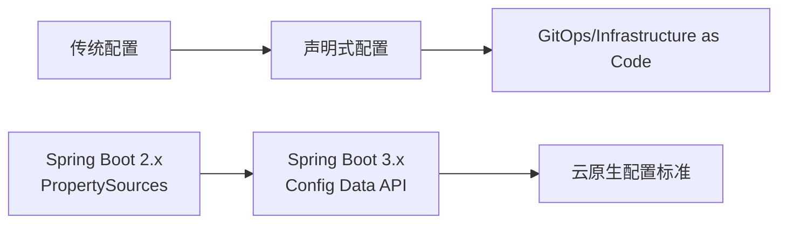
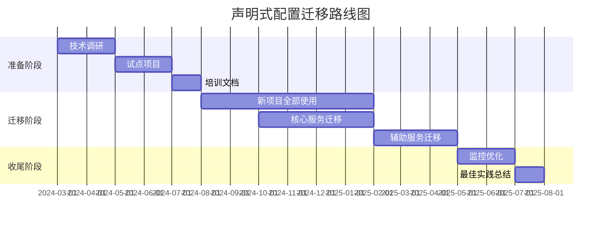

**是的，声明式配置绝对是未来主流趋势！** 让我给你详细分析：

## 为什么声明式配置会成为主流

### 1. **行业大趋势**



### 2. **技术演进路线**

```
Spring Boot 1.x/2.x: application.properties/yml + bootstrap.yml
                    ↓
Spring Boot 3.x:    spring.config.import + Config Data API
                    ↓
未来趋势:           统一配置标准 + 多配置源集成
```

### 3. **云原生生态驱动**

- **Kubernetes**: ConfigMap + Secrets (声明式)
- **Docker**: docker-compose.yml (声明式)
- **Terraform**: .tf 文件 (声明式)
- **Helm**: values.yaml (声明式)

## 声明式 vs 命令式配置对比

### **声明式配置**（What）

```
# 告诉系统"我想要什么"
spring:
  config:
    import:
      - nacos:common.yaml
      - nacos:app.yaml
      - configserver:http://config:8888
      - vault://localhost:8200
```

### **命令式/顺序式配置**（How）

```
# 告诉系统"如何做"
spring:
  cloud:
    nacos:
      config:
        shared-configs[0]:
          data-id: common.yaml
        shared-configs[1]:
          data-id: app.yaml
```

## 声明式配置的优势

### 1. **可移植性更好**

```
# 同一个配置，不同环境
spring:
  config:
    import:
      - optional:configserver:${CONFIG_SERVER_URL}
      - optional:nacos:${NACOS_CONFIG}
      - optional:file:/etc/config/
      - optional:classpath:config/
```

### 2. **配置源抽象**

```
// 统一接口，多种实现
ConfigDataLocationResolver:
  ├── NacosConfigDataLocationResolver
  ├── ConsulConfigDataLocationResolver
  ├── VaultConfigDataLocationResolver
  └── KubernetesConfigDataLocationResolver
```

### 3. **生命周期管理**

```
# 支持刷新、重试、回退等
spring:
  config:
    import:
      - nacos:app.yaml?refreshInterval=30s&failFast=false
      - configserver:config/refresh
```

## 现实挑战和过渡方案

### 挑战1：生态适配滞后

```
<!-- 很多组件还没适配 -->
<dependency>
    <groupId>com.alibaba.cloud</groupId>
    <artifactId>spring-cloud-starter-alibaba-nacos-config</artifactId>
    <version>2023.0.0.0</version>  <!-- 已适配 -->
</dependency>

<dependency>
    <groupId>org.springframework.cloud</groupId>
    <artifactId>spring-cloud-starter-consul-config</artifactId>
    <version>4.0.0</version>  <!-- 已适配 -->
</dependency>

<dependency>
    <groupId>org.springframework.cloud</groupId>
    <artifactId>spring-cloud-starter-zookeeper-config</artifactId>
    <!-- 可能还没完全适配 -->
</dependency>
```

### 挑战2：学习曲线

```
// 旧方式（熟悉）
@ConfigurationProperties(prefix = "app")
public class AppConfig {
    // 自动绑定
}

// 新方式（需要适应）
@ConfigurationProperties(prefix = "app")
@ConstructorBinding  // Spring Boot 3.x变化
public record AppConfig(String name, int port) {
}
```

## 行业实际应用情况

### 采用度调研

```
大厂（阿里、腾讯、字节）：✅ 已全面转向声明式
中型企业：🔄 正在过渡
传统企业：❌ 还在用传统方式
开源项目：✅ 新项目基本都用了
```

### 迁移成本分析

```
# 迁移成本 vs 收益矩阵
            短期成本  长期收益  推荐度
简单应用    低        中        ⭐⭐⭐⭐⭐
微服务      中        高        ⭐⭐⭐⭐
遗留系统    高        中        ⭐⭐
新项目      低        高        ⭐⭐⭐⭐⭐
```

## 给你的具体建议

### 短期策略（6个月内）

```
# 1. 新模块用声明式
spring:
  config:
    import: 
      - nacos:${spring.application.name}.yaml

# 2. 旧模块暂时保持
# 等到有充分理由再迁移
```

### 中期策略（1年内）

```
// 逐步迁移，分模块进行
@Configuration
public class MigrationConfig {
    
    @Bean
    @ConditionalOnProperty(name = "config.migration", havingValue = "new")
    public ConfigDataMigrationService migrationService() {
        // 新配置方式
    }
    
    @Bean
    @ConditionalOnProperty(name = "config.migration", havingValue = "legacy")
    public LegacyConfigService legacyService() {
        // 旧配置方式
    }
}
```

### 长期策略（1-2年）

```
# 完全转向声明式 + GitOps
spring:
  config:
    import:
      - git:https://github.com/your-org/config.git
      - kubernetes:configmap/app-config
      - vault://secrets/database
```

## 技术选型建议

```
# 选项1：激进派（技术驱动团队）
技术栈: Spring Boot 3.x + 声明式配置 + GitOps
优势: 技术先进，招聘有吸引力
风险: 踩坑多，文档少

# 选项2：稳健派（业务驱动团队）
技术栈: Spring Boot 2.7.x + 传统配置
优势: 稳定，社区支持好
风险: 技术债务累积

# 选项3：渐进派（混合团队）
技术栈: 
  - 新项目: Spring Boot 3.x + 声明式
  - 旧项目: 保持现状
  - 共用配置中心: Nacos 2.3.x
```

### 具体实施路线图



## 结论

### 明确回答你的问题：

1. **声明式配置会成为主流吗？**

   **✅ 绝对会！** 这是云原生和基础设施即代码的大趋势。

2. **现在就要用吗？**

   **🔄 看情况：**

   - **新项目**：强烈推荐用
   - **旧项目迁移**：评估ROI
   - **你的情况**：先用传统方式让项目跑起来，等技术栈稳定后再考虑

3. **对个人发展的影响？**

   - **必须学习**：这是未来3-5年的主流技术
   - **现在开始**：在个人项目/新模块中实践
   - **不要恐惧**：Spring团队做了很好的向后兼容

### 给你的最后建议：

```
# 当前项目（紧急）：
使用: 传统配置方式（一个文件搞定）
目标: 让项目先跑起来

# 个人学习（重要）：
学习: 声明式配置 + Spring Boot 3.x
实践: 建个Demo项目练手

# 未来规划（建议）：
2024年: 熟悉声明式配置
2025年: 在实际项目中应用
2026年: 成为团队技术专家
```