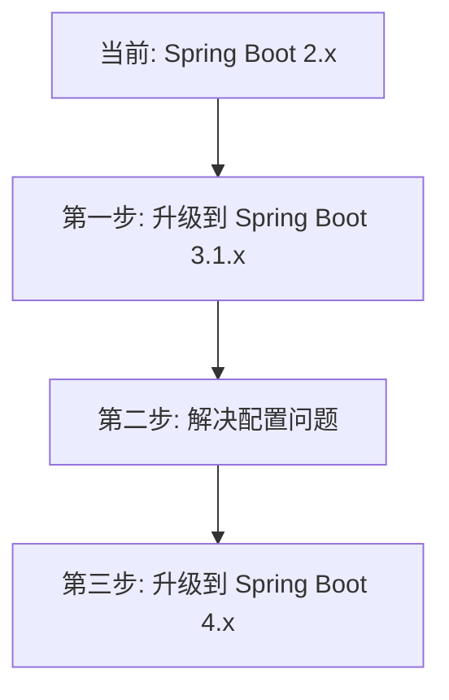

**这是一个很好的架构问题！** 我来详细分析一下：

## 配置策略对比分析

### 1. **顺序型配置**（你之前的2.x方式）

```
# bootstrap.yml
spring:
  cloud:
    nacos:
      config:
        shared-configs:
          - data-id: common.yaml
          - data-id: app.yaml
```

**优点**：

- ✅ 配置自动继承和覆盖
- ✅ 简单直观，符合直觉
- ✅ 社区案例多，文档丰富

**缺点**：

- ❌ Spring Boot 3.x支持有问题
- ❌ 配置顺序依赖强耦合
- ❌ 调试困难（不知道哪个配置最终生效）

### 2. **声明式配置**（Spring Boot 3.x新方式）

```
spring:
  config:
    import:
      - nacos:common.yaml
      - nacos:app.yaml
```

**优点**：

- ✅ Spring官方推荐的新标准
- ✅ 更灵活，支持多种配置源
- ✅ 配置源优先级明确

**缺点**：

- ❌ Nacos适配不完善（特别是变量继承）
- ❌ 学习成本高
- ❌ 社区实践少

## 升级必要性的深入分析

### 🔴 **不升级的代价**（保持现状）

1. **技术债务累积**：停留在Spring Boot 2.x生态
2. **安全风险**：老版本可能有未修复的漏洞
3. **功能限制**：无法使用Spring Boot 3.x/4.x的新特性
4. **社区支持下降**：Spring Boot 2.x已进入维护模式

### 🟢 **升级的好处**

1. **性能提升**：Spring Boot 3.x性能提升30%+
2. **原生支持**：GraalVM原生镜像、虚拟线程等
3. **长期支持**：Spring Boot 3.x支持到2025年
4. **生态更新**：Java 17+、Jakarta EE 9+等

### ⚠️ **升级的风险**

1. **兼容性问题**：如你遇到的配置继承问题
2. **学习成本**：需要适应新的配置方式
3. **稳定性风险**：新版本可能有未知bug

## 现实方案建议

### 方案A：**渐进式升级**（推荐）



**具体步骤**：

1. **先解决配置问题**：使用单一配置文件，放弃复杂的继承
2. **再升级Spring Boot**：到3.1.x（比3.2.x更稳定）
3. **最后升级Nacos**：到2.3.x

### 方案B：**配置架构重构**

与其纠结继承问题，不如重构配置架构：

```
# 1. 按环境分离，不按功能分离
# 以前：common.yaml + app.yaml
# 现在：dev.yaml + test.yaml + prod.yaml

# 2. 使用配置类封装
@ConfigurationProperties(prefix = "app")
public class AppConfig {
    // 所有配置在这里定义
}

# 3. 环境变量覆盖
spring.data.redis.host=${REDIS_HOST:localhost}
```

### 方案C：**混合方案**

```
# application.yml（本地开发）
spring:
  data:
    redis:
      host: localhost
      port: 6379

# nacos配置（生产环境）
# 只有生产特定的配置，其他使用默认值
spring:
  data:
    redis:
      host: ${REDIS_HOST}
      password: ${REDIS_PASSWORD}
```

## 我的建议

### **短期（1-2周内）**：

**不要升级！** 先专注于让项目跑起来。

```
# 使用最简单的配置
# aioveu-tenant.yaml（所有配置写在一起）
spring:
  data:
    redis:
      database: 0
      host: localhost
      port: 6379
  datasource:
    url: jdbc:mysql://localhost:3306/aioveu_tenant
    username: root
    password: root123
```

### **中期（1-2个月内）**：

评估升级成本，创建技术升级计划。

### **长期（3-6个月）**：

逐步升级到Spring Boot 3.x + Nacos 2.3.x。

## 具体操作建议

### 1. **立即操作**：

```
# 放弃配置继承，使用单一文件
# aioveu-tenant.yaml
redis:
  database: 0
  host: localhost
  port: 6379

mysql:
  host: localhost
  port: 3306
  username: root
  password: root123

# 然后直接引用
spring:
  data:
    redis:
      database: ${redis.database}
      host: ${redis.host}
      port: ${redis.port}
```

### 2. **如果必须用配置继承**：

```
// 自定义配置合并器
@Component
public class ConfigMerger {
    
    @PostConstruct
    public void mergeConfigs() {
        // 手动加载common和app配置
        // 手动合并
        // 设置到System Properties
    }
}
```

### 3. **考虑替代方案**：

```
# 使用Spring Config Server替代Nacos
spring:
  cloud:
    config:
      uri: http://config-server:8888
      name: aioveu-tenant,common
      profile: dev
```

## 总结

**我的最终建议**：

1. **不要为了配置继承而升级** - 配置继承不是核心业务需求
2. **采用简单配置策略** - 单一文件或环境变量
3. **等技术栈稳定后再考虑升级** - 现在Spring Boot 4.x刚发布，生态还不成熟
4. **优先保证项目能跑起来** - 功能先于架构

**回答你的问题**：

- **配置方式**：先选"简单可用"，再考虑"优雅"
- **升级必要**：目前**没有必要**，等技术生态更成熟
- **实际建议**：先用一个配置文件让项目跑起来，配置继承可以后期重构