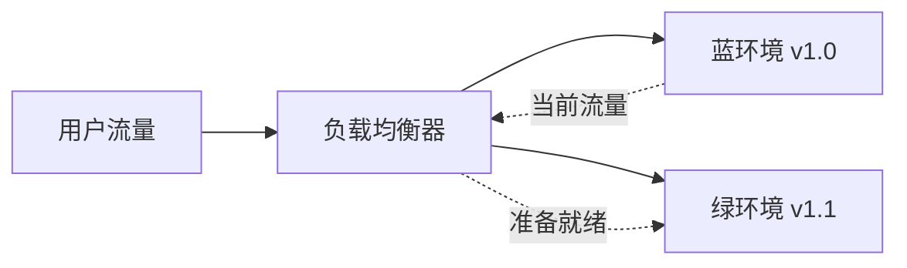

我的生产环境后端微服务更新的时候，怎么才能做到不影响正在使用的用户

要实现生产环境后端微服务更新时不影响用户，可以采取以下几种策略。核心思路是**避免停机、无缝切换、保证数据一致性**。

------

## 🎯 1. 部署策略

### 蓝绿部署 (Blue-Green Deployment)

- **原理**：维护两套完全相同但版本不同的生产环境（蓝环境和绿环境），切换流量即可完成更新。
- **优点**：零停机、快速回滚。
- **缺点**：资源成本翻倍。



### 金丝雀发布 (Canary Release)

- **原理**：逐步将用户流量从旧版本迁移到新版本（如先5%，再50%，最后100%）。
- **优点**：风险可控，可及时发现异常。
- **缺点**：发布周期稍长。

### 滚动更新 (Rolling Update)

- **原理**：逐步替换旧版本实例为新版本实例，一次只更新一部分实例。
- **适用**：Kubernetes 等容器平台原生支持。

------

## 🔧 2. 服务设计注意事项

### 数据库向后兼容

- 数据库 Schema 变更必须向后兼容

```
-- 错误：删除字段
ALTER TABLE users DROP COLUMN old_field;

-- 正确：先添加新字段，分阶段迁移
ALTER TABLE users ADD COLUMN new_field VARCHAR(255);
-- 应用先同时读写两个字段
-- 迁移完成后，再移除旧字段
```

### API 版本管理

```
# 通过 URL 版本控制
/api/v1/users
/api/v2/users

# 或通过 Header
Accept: application/vnd.myapi.v2+json
```

### 消息队列消费兼容

- 新旧消费者都能处理同一消息格式
- 使用 Schema Registry 管理消息格式

------

## 🏗️ 3. 微服务更新顺序

1. **先更新非核心、低流量服务**，验证后再更新核心服务
2. **数据库迁移** → **只读服务** → **读写服务** → **聚合服务**
3. 保持 API 兼容性至少 2-3 个版本周期

------

## 🔄 4. 具体操作步骤示例（以蓝绿部署为例）

### 步骤 1：准备新环境

```
# 部署新版本到绿环境
kubectl apply -f deployment-green.yaml
kubectl rollout status deployment/app-green

# 健康检查
curl https://green.your-api.com/health
```

### 步骤 2：迁移数据

```
# 执行数据库迁移（确保向后兼容）
./run-migration.sh --target-version=v2.0.0
```

### 步骤 3：流量切换

```
# Nginx 配置示例 - 逐步切流
upstream backend {
    server blue-service:8080 weight=90;  # 旧版本
    server green-service:8080 weight=10; # 新版本
}

# 逐步调整权重直到 0:100
```

### 步骤 4：监控与回滚准备

```
# 监控关键指标
- 错误率 < 0.1%
- 平均响应时间 < 200ms
- 99分位响应时间 < 1s
- 服务可用性 > 99.9%

# 一键回滚脚本
./rollback.sh --to-blue
```

------

## 🚨 5. 用户会话和状态管理

### 无状态服务

- 将会话信息存储在 Redis 等外部存储，而非应用内存
- 确保任何实例重启/替换不影响用户

### 优雅关闭

```
// Node.js 示例
process.on('SIGTERM', () => {
  console.log('收到终止信号，开始优雅关闭');
  
  // 1. 停止接收新请求
  server.close(() => {
    // 2. 等待现有请求完成
    // 3. 清理资源
    redis.quit();
    db.close();
    
    process.exit(0);
  });
  
  // 超时强制退出
  setTimeout(() => {
    console.error('优雅关闭超时，强制退出');
    process.exit(1);
  }, 30000);
});
```

------

## 📊 6. 监控和告警

部署期间需要特别关注：

1. **应用指标**
   - 错误率、异常数量
   - 响应时间 P50/P95/P99
   - QPS、吞吐量
2. **系统指标**
   - CPU/内存使用率
   - 数据库连接数
   - 队列积压情况
3. **业务指标**
   - 关键业务漏斗转化率
   - 订单成功率
   - 支付成功率

------

## 🔁 7. 回滚机制

必须预先准备好回滚方案：

```
# 回滚检查清单
1. ✅ 数据库回滚脚本已准备
2. ✅ 配置回滚版本已备份
3. ✅ 旧版本镜像仍在仓库
4. ✅ 回滚操作手册已编写
5. ✅ 回滚演练已完成
6. ✅ 回滚决策人已指定
```

------

## 🎪 8. 微信小程序特殊注意事项

由于微信小程序前端是静态的，需要注意：

1. **API 兼容性**
   - 确保旧版小程序也能调用新版 API
   - 至少维护 2 个版本的 API 同时在线
2. **热更新策略**

```
// 小程序端检测 API 版本
const checkApiVersion = async () => {
  try {
    const res = await request('/api/version');
    if (res.minVersion > getApp().globalData.appVersion) {
      // 提示用户更新小程序
      wx.showModal({
        title: '发现新版本',
        content: '请更新到最新版本',
        success: (res) => {
          if (res.confirm) {
            updateManager.applyUpdate();
          }
        }
      });
    }
  } catch (err) {}
};
```

------

## 📋 9. 部署前检查清单

| 项目 | 检查内容             | 负责人   |
| ---- | -------------------- | -------- |
| ✅    | 数据库迁移脚本已测试 | DBA      |
| ✅    | 新版本健康检查通过   | 运维     |
| ✅    | 回滚方案已验证       | 运维     |
| ✅    | 监控告警已设置       | 运维     |
| ✅    | 相关团队已通知       | 项目经理 |
| ✅    | 低峰时段（如凌晨）   | 运维     |
| ✅    | 灰度发布计划         | 开发     |

------

## 💡 最佳实践总结

1. **自动化一切** - 使用 CI/CD 流水线自动执行部署
2. **渐进式发布** - 永远不要一次性全量更新
3. **功能开关** - 新功能用 Feature Flag 控制
4. **监控驱动** - 基于指标做发布决策
5. **定期演练** - 每月进行故障恢复演练

------

## 你的情况需要考虑

如果你的微信小程序用户遇到了接口失效，结合后端更新，可以：

1. **检查发布时间** - 问题是否发生在后端部署期间？
2. **查看日志** - 后端更新是否导致了 token 验证逻辑变化？
3. **客户端兼容** - 新旧版本 API 是否兼容？

需要的话，我可以帮你设计具体的部署流程或回滚方案。你们目前使用什么部署平台？Kubernetes、Docker Swarm 还是传统服务器？