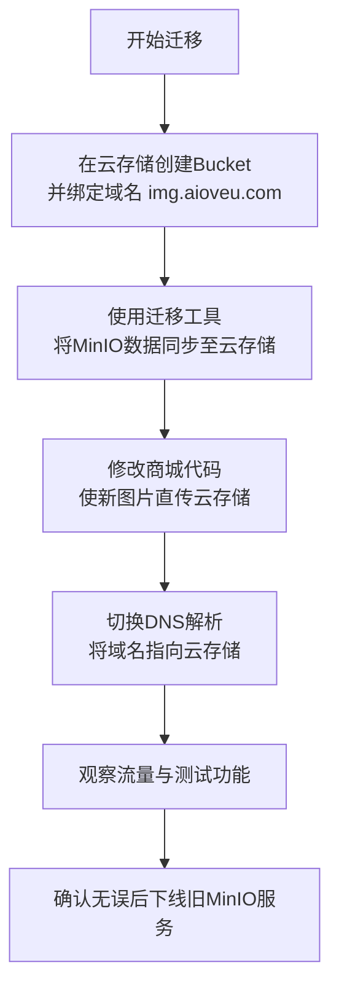

**不需要全部重新上传！**

这是一个非常普遍的误解。**切换云存储的核心是“迁移数据”，而不是“重新上传”。** 您不需要让用户或管理员手动重新传一遍所有图片。

正确的做法是：**将您现有MinIO服务器上的所有图片文件，通过工具自动、批量地搬运到新的云存储中，并且保持文件路径和名称不变。**

以下是清晰、可操作的迁移方案，保证您的业务无缝切换：

### **迁移的黄金原则：保持链接不变**

您的目标是：将 `https://img.aioveu.com/2025/01/product.jpg`这个链接背后的文件，从您的MinIO服务器，搬到云对象存储（如OSS/COS），而用户和前端代码**完全无感知**。

### **详细迁移步骤（以阿里云OSS为例）**

#### **第一步：在新平台做好准备**

1. **创建Bucket**：在阿里云OSS控制台，创建一个新的存储桶（Bucket），例如命名为 `shop-images`。
2. **绑定加速域名**：在该Bucket的“传输管理”或“域名管理”中，绑定您已有的CDN加速域名 `img.aioveu.com`。系统会为您生成一个CNAME地址，如 `img.aioveu.com.oss-cn-hangzhou.aliyuncs.com`。**先记录下来，但先不要修改DNS！**

#### **第二步：使用工具进行数据迁移（关键步骤）**

这是**一次性、自动化**的操作。您有以下几种高效的工具选择：

- **推荐：使用云商提供的命令行工具（最快最稳）**

  - **阿里云**：使用 **ossutil**

  - **腾讯云**：使用 **coscmd**

  - **操作原理**：在您的云服务器上安装该工具，配置好旧地址（MinIO）和新地址（OSS）的密钥，然后执行一条同步命令。

  - **示例命令（阿里云OSS）**：

    ```
    # 将本地MinIO挂载目录或通过FTP下载的整个目录，同步到OSS Bucket的根目录
    ossutil cp -r /path/to/your/minio/data/ oss://shop-images/ --update
    ```

  - 如果MinIO数据量很大（如TB级），可以考虑使用**离线迁移包**或**在线迁移服务**，云商通常提供这类服务。

- **备用：使用第三方同步工具**

  - 如 `rclone`，它支持包括MinIO、S3、OSS、COS在内的几乎所有存储协议。配置好源（MinIO）和目标（OSS）后，一键同步。

- **最后手段：编程分批迁移**

  - 如果文件数量不多，可以写一个简单的脚本，列出MinIO中所有文件，然后使用OSS SDK逐个上传到新Bucket，并保持相同路径。

#### **第三步：切换流量（关键时刻）**

1. **验证数据**：在OSS控制台的文件列表中，随机抽查一些文件，确认已全部同步，并且可以预览。
2. **修改代码**：将您商城的**文件上传功能**的代码，从原来上传到MinIO，改为上传到OSS（使用对应的SDK）。**这是您唯一需要修改代码的地方。** 确保新上传的图片直接进入OSS。
3. **切换DNS解析（关键一步）**：
   - 登录您的DNS服务商（Cloudflare）。
   - 找到 `img.aioveu.com`这条解析记录。
   - 将其目标值，从当前指向您服务器的IP或CNAME，**修改为第一步中OSS提供的那个CNAME地址**（如 `img.aioveu.com.oss-cn-hangzhou.aliyuncs.com`）。
   - **TTL值调低**：在切换前，将TTL设为较短时间（如60秒），以便快速生效和回退。
4. **等待生效**：DNS全球生效需要几分钟到几小时。生效后，所有对 `img.aioveu.com`的图片请求，将直接由阿里云OSS+CDN提供服务。

#### **第四步：收尾与观察**

1. **保持旧服务运行一段时间**：DNS切换后，由于缓存原因，可能有少量请求还会走到旧的MinIO服务器。建议保持MinIO服务在线但**设置为只读**，观察1-2周。
2. **监控与测试**：全面测试网站所有页面的图片显示，确保无误。
3. **下线旧服务**：确认所有流量都已稳定切换到OSS后，即可关停旧的MinIO服务器和相关的Nginx配置。**至此，迁移完成，您已成功“卸载”了图片流量。**

### **总结与流程图**

整个迁移过程可以概括为以下流程图：



**请务必记住：**

- **数据库里的图片链接完全不用动！** 链接还是 `https://img.aioveu.com/xxx.jpg`，只是背后的文件位置换了。
- **用户完全无感！** 整个过程在后台完成，网站访问不中断。
- **这是一次性操作！** 以后新上传的图片会通过新代码直接进入云存储。

迁移成功后，您将获得一个无限带宽、高可靠、免运维的图片服务，同时彻底释放您3Mbps服务器的带宽压力。