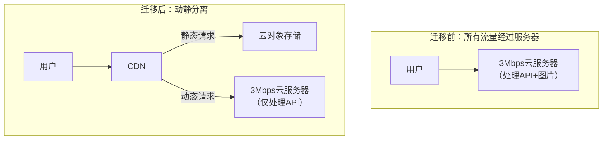

如果使用云存储，那我的后端压力就会变小，我的云服务器带宽还需要升级吗

**这是一个非常关键的问题。答案是：使用云存储后，您的云服务器带宽压力会急剧减小，但暂时不一定需要立即升级，需要根据动态API的负载情况来决定。**

让我们来详细拆解一下。

### 迁移后的流量路径变化

迁移到云存储+CDN后，您的系统流量路径会发生根本性改变：

从上图可以看出，最消耗带宽的图片、CSS、JS、字体等静态资源，**完全不再经过您的云服务器**。服务器的压力只剩下：

1. **用户登录、注册、下单等API请求**（数据量很小，通常几KB到几十KB）。
2. **商品列表、搜索等API请求**（返回的是JSON文本，数据量也不大）。
3. **后台管理系统的操作**（流量可忽略不计）。

### 具体分析与建议

#### **情况一：暂时无需升级（大多数场景）**

- **如果您的商城规模不大，用户并发量不高**，那么3Mbps带宽（约384KB/s）**足以应付纯动态API的请求**。
- **计算一下**：一个API响应平均10KB，3Mbps带宽理论上每秒可以处理 `(384KB/s) / (10KB/请求) ≈ 38个请求/秒`。这对于中小型商城的前端并发来说是足够的。
- **建议**：先完成迁移，然后**观察1-2周**。通过云服务器的监控面板，重点观察：
  - **公网出流量**
  - **CPU使用率**
  - **网络流入/流出包量**
  - 如果这些指标在高峰时段仍远未达到瓶颈（例如带宽使用率持续低于60%），就完全不需要升级。

#### **情况二：可能需要考虑升级**

- **如果您的商城有大量实时交互**，如聊天、频繁的订单状态推送、大量动态内容（非图片）。
- **或者迁移后API响应数据量很大**（例如单次商品列表API返回上百KB的JSON）。
- **又或者用户量增长迅猛**，API并发请求很高。
- **这时才需要考虑升级带宽或服务器配置。**

### 成本效益对比

让我们做一个简单的**成本估算**（以中国市场主流云服务商为例）：

| 项目           | 自建方案（升级后）                                | 云存储+CDN方案（保持3Mbps）                                  |
| -------------- | ------------------------------------------------- | ------------------------------------------------------------ |
| **服务器**     | 3Mbps -> **10Mbps**，月费增加 **≈ 200 - 300元**   | 保持3Mbps，**费用不变**                                      |
| **存储与带宽** | 需额外购买云盘存储图片，无CDN，流量费包含在带宽内 | **云存储费用**：约0.12元/GB/月（存储费） + **CDN回源流量费**：约0.15-0.25元/GB（远低于带宽费） |
| **总成本趋势** | **固定高成本**，为峰值流量预先付费，闲置浪费大。  | **按量付费**，用多少付多少。初期成本极低，随业务增长平缓增加。 |

**结论：迁移到云存储后，您大概率可以继续使用3Mbps的服务器，并享受更低的总体成本和更好的性能。**

### 最终行动路线图

1. **立即实施迁移**：将图片、视频、前端静态文件全部迁移到云对象存储（如阿里云OSS/腾讯云COS），并配置CDN加速。
2. **修改代码**：调整后端文件上传逻辑，改为直传云存储（通常使用前端直传+后端签名的安全模式）。
3. **更新链接**：将数据库中的静态资源地址前缀批量替换为CDN域名。
4. **密切监控**：迁移后，使用云服务商提供的监控工具，重点关注服务器**新的带宽使用情况**。
   - **监控指标**：`公网出带宽利用率`、`CPU使用率`、`网络连接数`。
5. **决策是否升级**：
   - 如果监控显示带宽使用率长期低于70%，**维持原配置**。
   - 如果经常跑满或出现延迟，**再考虑升级服务器带宽或配置**。此时升级，目标也更明确（只为动态API服务付费）。

**一句话总结：先迁移，后观察。迁移本身就能解决您图片慢的核心瓶颈，并极有可能让您省下升级带宽的费用。** 这是典型的“云原生”思维——将静态流量卸载到无限扩展的云服务上，让有限的服务器资源专注于它最擅长的动态计算。