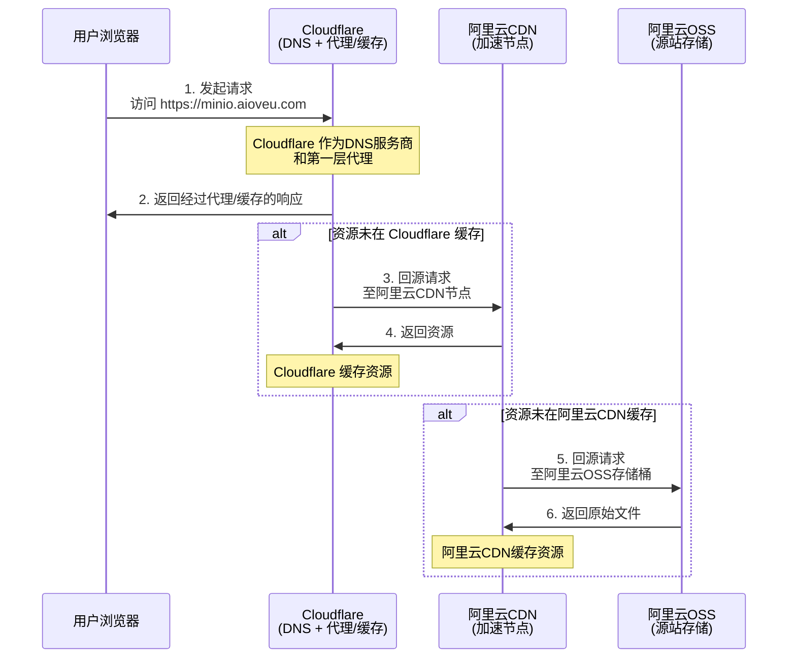

根据我们之前的全部讨论和您描述的架构，**访问顺序非常明确：浏览器最先访问的是 Cloudflare**。

以下是完整的、端到端的请求处理顺序流程图，它清晰地展示了从用户发起请求到获取资源的完整路径：

### **详细步骤分解**

1. **第一步：DNS 解析（由 Cloudflare 接管）**
   - 当用户在浏览器输入 `https://minio.aioveu.com`并回车时，浏览器首先会查找这个域名的 DNS 解析记录。
   - 由于您将域名的 DNS 服务器设置为了 Cloudflare 提供的地址（如 `cara.ns.cloudflare.com`），因此 **DNS 查询请求会直接发往 Cloudflare 的全球 DNS 网络**。Cloudflare 会返回其指定的 IP 地址（这通常是离用户最近的 Cloudflare 边缘节点的 IP）。
2. **第二步：请求到达 Cloudflare 网络（第一层代理与安全）**
   - 浏览器根据获得的 IP，向 Cloudflare 的边缘节点发起 HTTPS 请求。
   - Cloudflare 在此处扮演了 **反向代理和 Web 应用防火墙（WAF）** 的角色。它会执行一系列操作：验证 SSL/TLS 证书（使用 Cloudflare 自己的边缘证书）、应用安全规则、检查是否有缓存的资源。
3. **第三步：Cloudflare 回源至阿里云 CDN**
   - 如果请求的资源在 Cloudflare 的边缘节点没有缓存（或缓存过期），Cloudflare 会作为客户端，向下一跳——也就是您配置的 **阿里云 CDN** 发起回源请求。
   - 这个回源请求的目标地址，就是您在 Cloudflare 的 DNS 记录中为 `minio.aioveu.com`设置的 **CNAME 值**（即阿里云 CDN 提供的地址，如 `minio.aioveu.com.w.kunlunsl.com`）。
4. **第四步：阿里云 CDN 处理并可能回源至 OSS**
   - 请求到达阿里云 CDN 的某个边缘节点。
   - 阿里云 CDN 检查自身缓存。如果有所需资源，则直接返回给 Cloudflare。
   - 如果阿里云 CDN 节点上没有缓存，它会继续向最终的 **源站（阿里云 OSS）** 发起回源请求，拉取文件后再逐级返回并缓存。
5. **第五步：响应返回给用户**
   - 资源从阿里云 CDN 返回给 Cloudflare，再由 Cloudflare 返回给用户的浏览器。

### **总结**

所以，您的架构形成了一个 **双层加速/代理** 结构：

**用户浏览器 -> Cloudflare（第一层：全球DNS、安全、缓存） -> 阿里云CDN（第二层：区域性加速、缓存） -> 阿里云OSS（源站存储）**

在这个链条中，**Cloudflare 是用户请求的第一个接触点**。它不仅是 DNS 解析的起点，也是所有网络流量必须经过的第一个服务层。您遇到的“配置中”或 SSL 问题，都发生在这个链条的初始环节，因此排查重点始终应放在 Cloudflare 的 DNS 设置、代理状态以及它与下一跳（阿里云 CDN）的连接上。