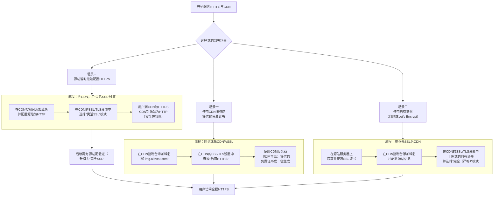

这是一个非常经典的部署问题。**答案是：两者可以同步进行，但通常建议“先有SSL证书，再配置CDN”或“同步配置”，以确保服务上线时就是安全且流畅的。**

具体流程和最佳实践取决于您采用的证书类型和CDN服务商。我将为您梳理清晰的步骤和逻辑。

### 一、 核心原则与最佳实践

**核心目标**：确保最终用户通过 `https://您的域名`访问时，从浏览器到CDN，再从CDN回源到您服务器的**整条链路都是加密的（即全程HTTPS）**。

为了实现这个目标，**在理想情况下，您需要两个SSL证书**：

1. **CDN边缘证书**：用于加密“用户浏览器 ↔ CDN”这段连接。
2. **源站证书**：用于加密“CDN回源节点 ↔ 您的源服务器”这段连接。

### 二、 不同场景下的部署流程

以下是三种常见场景的部署流程对比，您可以根据自身情况选择：

#### **场景一：使用CDN服务商（如阿里云、腾讯云）提供的免费SSL证书**

这是**最快捷、最推荐新手使用**的方式。

- **流程**：直接在CDN控制台为您的加速域名（如 `img.aioveu.com`）申请或启用其提供的免费证书。证书的申请、部署、续期全部由CDN服务商自动完成。
- **优点**：省心省力，无需自己管理证书。
- **回源方式**：通常，在您使用CDN服务商的证书时，CDN到源站可以配置为 **“灵活SSL”**（即CDN到源站走HTTP）。**但从安全最佳实践出发，强烈建议源站也配置SSL，并最终使用“完全（严格）”模式。**

#### **场景二：使用自己购买的或通过Let‘s Encrypt签发的SSL证书**

这是**最规范、安全性最高**的方式。

- **流程**：
  1. **首先**，为您的源站域名（例如，如果CDN回源到 `minio.aioveu.com`，则为该域名）获取并安装SSL证书。
  2. **然后**，在CDN控制台配置加速域名时，上传这张相同的证书（或为此加速域名另购一张）。
  3. 在CDN的SSL/TLS设置中，选择 **“完全（Full）”** 或 **“完全（严格）（Full/Strict）”** 模式。
- **优点**：实现端到端全程HTTPS加密，安全性最高。

#### **场景三：源站暂时无法配置HTTPS（过渡方案）**

- **流程**：您可以先配置CDN。在CDN的SSL/TLS设置中，选择 **“灵活SSL（Flexible SSL）”** 模式。
- **工作原理**：用户到CDN是HTTPS加密的，但CDN回源到您的服务器时使用HTTP。
- **注意**：这不是一个安全的长期方案，因为回源链路是明文的。**这应仅作为临时过渡方案**，目标仍然是尽快为源站配置SSL，并切换到“完全”模式。

### 三、 针对您当前情况 (`img.aioveu.com`) 的建议

基于我们之前的讨论，您的 `img.aioveu.com`已经接入了阿里云CDN，并且可以直接访问。这表明您的CDN基础配置是通的。现在的重点是解决SSL问题。

1. **诊断当前状态**：登录阿里云CDN控制台，检查您的加速域名 `img.aioveu.com`的 **“HTTPS配置”**。
   - 查看是否已配置SSL证书。
   - 查看 **“SSL证书”** 来源是“云盾证书中心”（阿里云提供）还是“自定义”（您自己上传）。
   - 查看 **“SSL协议”** 和 **“TLS版本”** 设置。**请确保已启用TLSv1.2和TLSv1.3，并禁用不安全的TLSv1.0和TLSv1.1**。这很可能是之前 `*.w.cdngslb.com`出现SSL错误的原因。
2. **操作建议**：
   - **如果控制台显示未配置证书**：您可以直接在阿里云CDN控制台内，为该域名**免费申请一张SSL证书**（DV型）。这是最快的方法。
   - **如果控制台显示已配置证书但仍有问题**：检查证书是否过期，以及TLS协议版本是否过低，按上述建议修改。
   - **长远规划**：如果您的源站 `minio.aioveu.com`也计划启用HTTPS（这能提升回源安全性），那么您需要为该域名也准备一张证书。然后，将CDN的回源协议从HTTP改为HTTPS，并将SSL模式从“灵活”升级为“完全”。

**总结：对于您的情况，最直接的行动是登录阿里云CDN控制台，为 `img.aioveu.com`配置或检查其SSL证书及TLS协议设置。这通常可以独立于源站的SSL状态先行完成，并立即解决用户访问的HTTPS问题。**