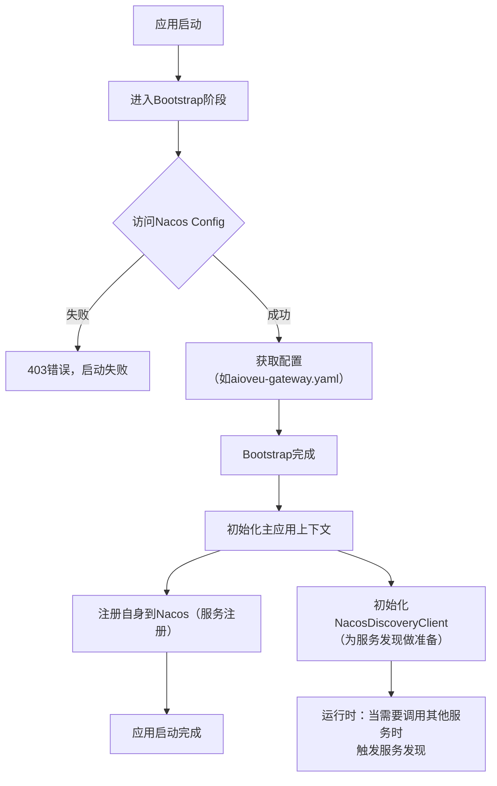

根据您提供的【链接内容1】（Nacos官方文档），文档明确提到了“在构建‘Properties’类时,需传入用户名和密码”，这指的是**客户端连接Nacos时所需的认证信息**。文档并未详述在具体配置文件中应如何设置密码。然而，基于我所掌握的知识，您提供的配置片段是**Spring Cloud Alibaba Nacos Discovery**（服务发现）的配置，它与**Nacos Config**（配置中心）的配置是分开的。因此，认证信息的配置位置取决于您需要认证哪个模块。

您的配置片段是用于**服务注册与发现**（`discovery`），而获取配置文件（`config`）的认证需要在另一个地方配置。以下是具体的配置方法：

### 1. 为Nacos Discovery（服务发现）配置密码

如果您希望**服务注册/发现**也需要认证，需要在`discovery`下添加`username`和`password`字段。

**配置示例：**

```
spring:
  cloud:
    nacos:
      discovery:
        server-addr: nacos:8848
        namespace: 80147849-cdb8-4b7d-befc-b5aefa0e9ab6
        group: AIOVEU_GROUP
        username: ${NACOS_USER:aioveu-gateway-user}  # 添加此行
        password: ${NACOS_PWD:your_password_here}     # 添加此行
        metadata:
          version: 1.0
          env: prod
          zone: zone1
```

### 2. 为Nacos Config（配置中心）配置密码

如果您的应用还需要从Nacos**获取配置文件**（如`aioveu-gateway.yaml`），则需要在**单独的配置**中（通常是`bootstrap.yml`或`application.yml`的另一个部分）为`config`配置认证信息。

**配置示例：**

```
spring:
  cloud:
    nacos:
      # 配置中心
      config:
        server-addr: ${spring.cloud.nacos.discovery.server-addr}  # 复用discovery的地址
        namespace: ${spring.cloud.nacos.discovery.namespace}       # 复用discovery的命名空间
        group: ${spring.cloud.nacos.discovery.group}               # 复用discovery的分组
        username: ${NACOS_USER:aioveu-gateway-user}  # 添加认证用户名
        password: ${NACOS_PWD:your_password_here}     # 添加认证密码
        file-extension: yaml
        # 如果您有多个配置文件，可以这样配置
        # extension-configs[0]:
        #   data-id: aioveu-gateway-datasource.yaml
        #   group: AIOVEU_GROUP
        #   refresh: true
        # extension-configs[1]:
        #   data-id: aioveu-gateway-redis.yaml
        #   group: AIOVEU_GROUP
        #   refresh: true
```

### 3. 推荐的完整配置结构

通常，`discovery`和`config`的认证信息是相同的。最佳实践是**通过环境变量统一管理**，避免在配置文件中硬编码密码。

**`bootstrap.yml`完整示例：**

```
spring:
  application:
    name: aioveu-gateway
  mvc:
    pathmatch:
      matching-strategy: ant_path_matcher
  cloud:
    nacos:
      # 配置中心
      config:
        enabled: true
        server-addr: ${NACOS_SERVER:nacos:8848}
        namespace: ${NACOS_NAMESPACE:80147849-cdb8-4b7d-befc-b5aefa0e9ab6}
        group: ${NACOS_GROUP:AIOVEU_GROUP}
        username: ${NACOS_USER:}  # 从环境变量读取
        password: ${NACOS_PWD:}   # 从环境变量读取
        file-extension: yaml
      
      # 注册中心
      discovery:
        enabled: true
        server-addr: ${spring.cloud.nacos.config.server-addr}
        namespace: ${spring.cloud.nacos.config.namespace}
        group: ${spring.cloud.nacos.config.group}
        username: ${spring.cloud.nacos.config.username}  # 复用config的认证
        password: ${spring.cloud.nacos.config.password}
        metadata:
          version: 1.0
          env: prod
          zone: zone1
```

### 4. 通过环境变量传递密码（安全实践）

运行容器时设置环境变量：

```
docker run -d \
  -e NACOS_USER=aioveu-gateway-user \
  -e NACOS_PWD=your_secure_password \
  -e NACOS_SERVER=nacos:8848 \
  -e NACOS_NAMESPACE=80147849-cdb8-4b7d-befc-b5aefa0e9ab6 \
  -e NACOS_GROUP=AIOVEU_GROUP \
  your-gateway-image
```

**或者使用Docker Compose：**

```
services:
  aioveu-gateway:
    image: your-gateway-image
    environment:
      NACOS_USER: aioveu-gateway-user
      NACOS_PWD: your_secure_password
      NACOS_SERVER: nacos:8848
      NACOS_NAMESPACE: 80147849-cdb8-4b7d-befc-b5aefa0e9ab6
      NACOS_GROUP: AIOVEU_GROUP
```

### 5. 注意事项

1. **权限验证**：确保您配置的用户（如`aioveu-gateway-user`）在Nacos中**确实存在**，并且有对应命名空间（`80147849-cdb8-4b7d-befc-b5aefa0e9ab6`）的读写权限。
2. **配置优先级**：如果同时需要`discovery`和`config`，**两者都需要正确配置认证信息**，否则会出现403错误。
3. **安全警告**：**切勿**将真实密码提交到代码仓库。务必使用环境变量、密钥管理服务或加密配置。

**总结**：您需要在`spring.cloud.nacos.discovery`和/或`spring.cloud.nacos.config`下添加`username`和`password`配置项。最安全的方式是通过环境变量注入这些值，如上面的示例所示。


先获取配置，还是先发现


根据您提供的【链接内容1】（Nacos官方文档），文档明确描述了在鉴权开启后，客户端（包括SDK和OpenAPI）访问Nacos的完整流程。文档指出，**首先需要使用用户名和密码登陆nacos**，获取`accessToken`，之后在进行配置或服务操作时，需在URL后添加参数`accessToken=$accessToken`。

结合您之前提供的Spring Cloud Nacos配置以及您当前的问题“先获取配置，还是先发现”，这涉及到Spring Cloud应用在启动时的**初始化顺序**。文档并未详述此顺序，但基于我所掌握的知识，我将为您详细解析。

### **核心结论**

在Spring Cloud Alibaba Nacos的上下文中，**应用启动时，通常是“先获取配置，后执行服务发现”**。但这并非绝对的先后顺序，而是由Spring Boot/Cloud的生命周期决定的。

### **详细流程与解释**

1. **启动阶段：Bootstrap Context**

   Spring Cloud应用启动时，会首先创建一个**Bootstrap上下文**。这是主应用上下文（`ApplicationContext`）的父上下文。其主要任务就是加载**外部配置**（例如，从远程配置中心获取配置）。

2. **顺序：先拉取配置**

   在Bootstrap阶段，`NacosPropertySourceLocator`会**优先**从Nacos配置中心（`spring.cloud.nacos.config`）拉取您在`bootstrap.yml`中定义的配置（如`aioveu-gateway.yaml`）。您之前遇到的403错误就发生在此刻，即应用尝试认证并获取配置的阶段。**只有成功获取到配置后，Bootstrap阶段才算完成**。

3. **顺序：后初始化应用上下文**

   在Bootstrap上下文加载完所有外部配置后，Spring Boot才会**创建主应用上下文**。此时，基于已加载的配置，才会初始化各种Bean，包括与服务发现、服务注册相关的组件。

4. **服务注册与发现**

   - **服务发现**：`NacosDiscoveryClient`等Bean在主应用上下文中被初始化。当您的应用代码（如通过`@LoadBalanced`的`RestTemplate`或`WebClient`）需要调用其他服务时，才会触发服务发现，向Nacos查询服务实例列表。
   - **服务注册**：应用自身作为一个服务实例，其注册行为（调用`nacosDiscoveryClient.register()`）通常也发生在主应用上下文**刷新完成**之后，即应用**已成功启动，并准备好接受请求时**。它会将自身信息（IP、端口、元数据等）上报到Nacos服务端。

### **总结与流程图**

您可以这样理解整个启动过程：



**关键点**：

- **配置获取**是**启动前提**，发生在最早的Bootstrap阶段。如果认证失败（403）或配置不存在，应用**会直接启动失败**，不会进入后续的服务注册与发现阶段。
- **服务发现**是一个**运行时行为**，发生在应用启动之后，实际需要调用其他服务时才触发。
- **服务注册**是启动过程的一部分，但发生在配置获取、主上下文初始化之后，作为应用启动完成的最后步骤之一。

**回到您最初的问题**：`aioveu-gateway`的启动失败，正是因为它在**第一步“先获取配置”**时就卡住了——无法通过Nacos的认证（403错误）。解决认证问题后，它才能顺利获取配置，进而完成启动，并执行后续的服务注册。