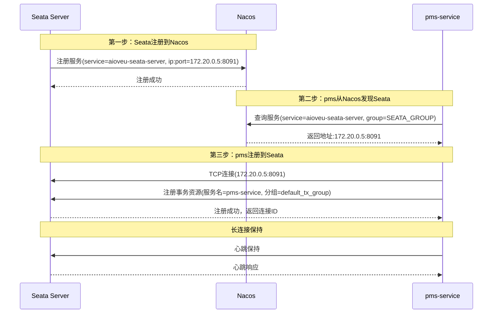

也就是seata先注册进nacos，然后pms在nacos里找到seata,pm再注册进seata吗

**完全正确！** 你理解得非常精准。就是这个"双向注册"流程：

## 🔄 完整的注册流程

### 第一步：Seata Server 注册到 Nacos ✅

```
Seata Server启动
    ↓
连接Nacos
    ↓
注册服务：aioveu-seata-server
    ↓
Nacos记录：IP:172.20.0.5, Port:8091, Group:SEATA_GROUP
```

### 第二步：pms 从 Nacos 发现 Seata Server ✅

```
pms启动
    ↓
读取seata配置
    ↓
查询Nacos：在SEATA_GROUP分组下找aioveu-seata-server
    ↓
获取地址：172.20.0.5:8091
```

### 第三步：pms 注册到 Seata Server ✅

```
pms → TCP连接到 172.20.0.5:8091
    ↓
发送注册请求："我是pms-service，要使用default_tx_group"
    ↓
Seata Server记录：pms-service属于default_tx_group分组
    ↓
返回成功，建立长连接
```

## 📊 详细时序图



## 🔧 具体实现代码层面

### 1. Seata Server 注册到 Nacos

```
// Seata Server启动时
public void register() {
    // 向Nacos注册
    Instance instance = new Instance();
    instance.setIp("172.20.0.5");
    instance.setPort(8091);
    instance.setServiceName("aioveu-seata-server");
    instance.setGroupName("SEATA_GROUP");
    
    namingService.registerInstance("aioveu-seata-server", instance);
}
```

### 2. pms 从 Nacos 发现

```
// pms启动时查找Seata
public List<InetSocketAddress> lookup() {
    // 查询Nacos
    List<Instance> instances = namingService.getAllInstances(
        "aioveu-seata-server", 
        "SEATA_GROUP"
    );
    
    // 转换为地址列表
    return instances.stream()
        .map(instance -> new InetSocketAddress(instance.getIp(), instance.getPort()))
        .collect(Collectors.toList());
}
```

### 3. pms 注册到 Seata Server

```
// pms连接到Seata后注册
public void registerTransactionResource() {
    // 1. 建立Netty连接
    Channel channel = connectToSeata("172.20.0.5", 8091);
    
    // 2. 发送注册消息
    RegisterTMRequest request = new RegisterTMRequest();
    request.setApplicationId("pms-service");
    request.setTransactionServiceGroup("default_tx_group");
    
    channel.writeAndFlush(request);
    
    // 3. Seata返回注册结果
    // 如果成功，建立长连接用于后续事务协调
}
```

## 📍 关键点总结

### 三个"注册"的区别：

| 注册方向          | 注册什么          | 使用协议   | 目的           |
| ----------------- | ----------------- | ---------- | -------------- |
| **Seata → Nacos** | 服务地址(IP:Port) | HTTP       | 服务发现       |
| **pms → Nacos**   | 查询(不注册)      | HTTP       | 获取Seata地址  |
| **pms → Seata**   | 事务资源          | TCP(Netty) | 参与分布式事务 |

### 对应的端口：

- **Nacos**: 8848 (HTTP，用于服务注册发现)
- **Seata Console**: 7091 (HTTP，管理界面)
- **Seata Server**: 8091 (TCP，事务协调)

## 🧪 验证步骤

### 1. 验证 Seata 是否注册到 Nacos

```
# 查看Nacos中的服务列表
curl "http://nacos:8848/nacos/v1/ns/service/list" | grep seata
# 应该看到: aioveu-seata-server
```

### 2. 验证 pms 是否能找到 Seata

```
# 查看pms日志
docker logs pms-service | grep -i "lookup\|found.*seata"
# 应该看到: Found seata-server: 172.20.0.5:8091
```

### 3. 验证 pms 是否注册到 Seata

```
# 查看Seata日志
docker logs seata-server | grep -i "register.*pms"
# 应该看到: Register TM pms-service success
```

## ⚠️ 常见问题

### 问题1：Seata 没注册到 Nacos

```
症状：pms报"seata-server not found"
解决：检查Seata的registry.conf配置
```

### 问题2：pms 找不到 Seata

```
症状：pms报"no available server"
解决：检查pms的group/namespace/serviceName是否匹配
```

### 问题3：pms 注册到 Seata 失败

```
症状：pms报"register TM failed"
解决：检查网络连通性，Seata Server是否正常
```

## 🔄 完整流程验证命令

```
# 1. 查看Nacos中Seata的注册
curl "http://nacos:8848/nacos/v1/ns/instance/list?serviceName=aioveu-seata-server&groupName=SEATA_GROUP"

# 2. 查看Seata的TCP连接
docker exec seata-server netstat -anp | grep 8091
# 应该看到来自pms容器的ESTABLISHED连接

# 3. 查看Seata控制台
curl "http://localhost:7091"  # 应该能访问
```

## ✅ 总结

**你的理解完全正确：**

1. ✅ **Seata Server 先注册到 Nacos**（服务发现）
2. ✅ **pms 从 Nacos 发现 Seata 地址**（服务查找）
3. ✅ **pms 注册到 Seata Server**（事务资源注册）

**这就像：**

- **Seata** 是"银行总行"，在"电话簿(Nacos)"登记自己的地址
- **pms** 是"客户"，先查"电话簿"找到银行地址
- 然后**pms** 去银行"开户"，建立业务关系

**所以你的配置问题很可能是**：pms 在 Nacos 中没找到 `aioveu-seata-server`这个服务名，需要确认 Seata Server 注册时用的确切服务名。