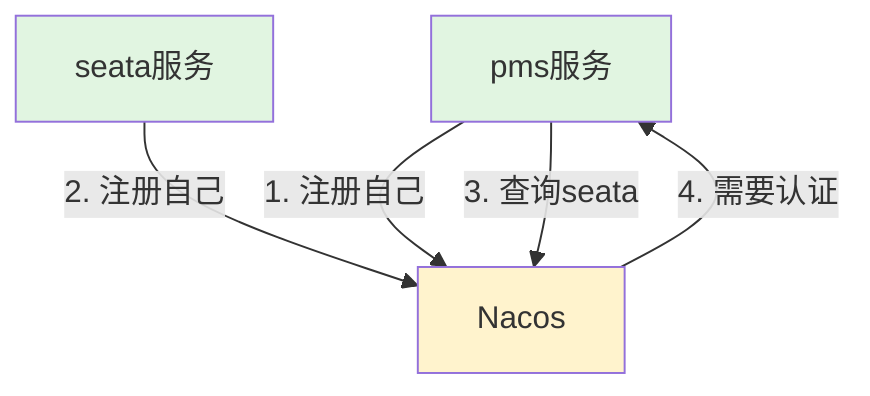

pms和seat都注册进nacos了，为啥pms找seata还需要认证

**这是个很好的问题！** 答案是：**pms 和 seata 注册到 Nacos 是两个独立的认证过程**。

## 🔍 两个独立的认证流程

### 流程1：服务注册到 Nacos（已成功）

```
pms → 注册到Nacos
      ↓
   使用 spring.cloud.nacos.discovery.username/password ✅
      ↓
   Nacos记录：pms-service 在 DEFAULT_GROUP

seata → 注册到Nacos
      ↓
   使用 registry.conf 中的 username/password ✅
      ↓
   Nacos记录：aioveu-seata-server 在 SEATA_GROUP
```

### 流程2：pms 从 Nacos 查找 seata（现在失败）

```
pms → 查询Nacos："我要找aioveu-seata-server"
      ↓
   使用 seata.registry.nacos.username/password ❌ 没配！
      ↓
   Nacos返回："user not found!"
```

## 📊 认证分离示意图




## 🎯 为什么需要两次认证？

### 1. **不同的配置模块**

- **pms注册自己**：用的是 `spring.cloud.nacos.discovery`配置
- **pms查询seata**：用的是 `seata.registry.nacos`配置
- **两套配置独立，认证信息不共享**

### 2. **不同的使用场景**

| 场景              | 配置位置             | 认证目的            |
| ----------------- | -------------------- | ------------------- |
| pms注册到Nacos    | `spring.cloud.nacos` | 让其他服务能发现pms |
| pms从Nacos查seata | `seata.registry`     | 让pms能找到seata    |

## 🔧 查看你的实际配置

### 1. pms 注册 Nacos 的配置（可能已配）

```
spring:
  cloud:
    nacos:
      discovery:
        server-addr: nacos:8848
        namespace: 80147849-cdb8-4b7d-befc-b5aefa0e9ab6
        group: DEFAULT_GROUP
        username: nacos    # ✅ 这里可能配了
        password: nacos    # ✅
```

### 2. pms 查询 seata 的配置（没配认证）

```
seata:
  registry:
    type: nacos
    nacos:
      application: aioveu-seata-server
      server-addr: ${nacos.server-addr}
      namespace: 80147849-cdb8-4b7d-befc-b5aefa0e9ab6
      group: SEATA_GROUP
      # ❌ 这里没配 username/password！
```

## 🔄 完整的认证链条

```
pms启动
    ├─ 使用spring.cloud.nacos配置 → 注册到Nacos ✅
    │      （带认证：username/password）
    │
    └─ 使用seata.registry配置 → 查询Nacos找seata ❌
           （没带认证：缺失username/password）
           ↓
        Nacos拒绝："user not found!"
```

## ⚠️ 常见误解

### 误解1："我已经注册了，就能自动查询"

不对！注册和查询是**两个独立的HTTP请求**，都需要认证。

### 误解2："用同一个Nacos连接，认证会共享"

不对！Spring Cloud的Nacos客户端和Seata的Nacos客户端是**两个不同的库**，不共享认证信息。

### 误解3："只要一次登录就行"

Nacos使用**每次请求都需要认证**的机制（HTTP Basic Auth），不是会话保持。

## 🧪 验证这个理论

### 测试1：查看pms注册Nacos的请求

```
# 开启Nacos访问日志
# 在Nacos容器中
tail -f /home/nacos/logs/access_log.2025-03-03.log

# 重启pms，会看到：
# POST /nacos/v1/ns/instance - 注册pms（带认证头）
# GET  /nacos/v1/ns/instance/list - 查询seata（无认证头）
```

### 测试2：手动模拟两个请求

```
# 1. 模拟pms注册（带认证）
curl -u "nacos:nacos" -X POST \
  "http://nacos:8848/nacos/v1/ns/instance" \
  -d "serviceName=pms-service&ip=172.20.0.6&port=8802"

# 2. 模拟pms查询seata（不带认证）
curl "http://nacos:8848/nacos/v1/ns/instance/list?serviceName=aioveu-seata-server"
# 返回：user not found!

# 3. 模拟pms查询seata（带认证）
curl -u "nacos:nacos" \
  "http://nacos:8848/nacos/v1/ns/instance/list?serviceName=aioveu-seata-server"
# 返回：seata实例列表
```

## ✅ 解决方案

### 方案1：补全seata.registry的认证

```
seata:
  registry:
    nacos:
      username: nacos  # ✅ 必须加
      password: nacos  # ✅ 必须加
```

### 方案2：统一认证配置

```
# 在application.yml中定义公共变量
nacos:
  server-addr: nacos:8848
  namespace: 80147849-cdb8-4b7d-befc-b5aefa0e9ab6
  username: nacos
  password: nacos

spring:
  cloud:
    nacos:
      discovery:
        server-addr: ${nacos.server-addr}
        namespace: ${nacos.namespace}
        username: ${nacos.username}
        password: ${nacos.password}

seata:
  registry:
    nacos:
      server-addr: ${nacos.server-addr}
      namespace: ${nacos.namespace}
      group: SEATA_GROUP
      username: ${nacos.username}  # 使用同一个
      password: ${nacos.password}  # 使用同一个
```

## 🔍 为什么设计成这样？

### 设计原因：

1. **安全性**：查询敏感的服务信息也需要认证
2. **灵活性**：可以用不同账号注册和查询
3. **模块化**：Spring Cloud和Seata是不同的框架

### 实际场景：

- 开发环境：都用一个账号
- 生产环境：可能用不同账号（注册账号 vs 查询账号）
- 多租户：不同服务用不同认证

## 💡 一句话总结

**pms 注册到 Nacos 和 pms 从 Nacos 查询 seata 是两套独立的配置，都需要单独配置认证信息。** 你现在只配了注册的认证，没配查询的认证。